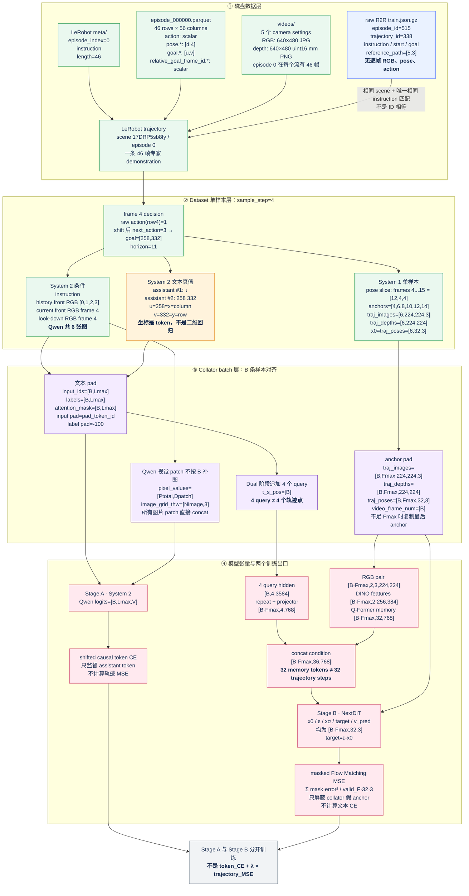

# DualVLN 数据结构图

这张 Mermaid 图从真实磁盘文件开始，一直画到 `Dataset.__getitem__()`、collator batch 和两个训练
loss。图中所有具体数字都来自本机样本：R2R scene `17DRP5sb8fy`、LeRobot episode 0、decision
frame 4。图本身就是 Markdown 源码，不依赖单独图片文件。

## A. 真实源数据结构树：每个叶子都能直接打开

下面不是示意目录，而是本机真实数据的一个完整实例。共享盘源目录是
`/mnt/cpfs/zbl-cpfs-new/open_data/InternData-N1/vln_ce/traj_data/r2r/17DRP5sb8fy`。因为 VS Code
不能直接阅读 gzip/Parquet，并且会错误解析 `/mnt/...` Markdown 链接，所以每个链接都指向仓库内的
只读副本或等价解包文件。也可以先看机器可读的
[source_data_tree.json](examples/r2r_17DRP5sb8fy_ep0_frame4/source_data_tree.json)。
打开后先看最顶部的 `_provenance_comment`：它明确说明该文件由哪个脚本生成、没有单一原文件，
以及 `source_path`、`viewable_export` 和 `derived_training_view` 分别代表什么。每个子节点的
`_comment` 又标出了对应原路径、抽取条件和加工方式。

- `raw_data/r2r/train/train.json.gz`：Habitat 使用的 R2R 任务集合，不是逐帧训练数据。
  - [解出的 raw episode 515](examples/r2r_17DRP5sb8fy_ep0_frame4/raw_r2r_episode_515.json)：包含
    `episode_id=515`、`trajectory_id=338`、scene、instruction、start、goal、geodesic distance 和
    5 个 reference-path 世界坐标；不含逐帧 RGB、depth、pose、action。

- `traj_data/r2r/17DRP5sb8fy/`：scene 级 LeRobot demonstration，共 75 个 episode、3237 帧。
  - `meta/`：描述“有哪些 episode、task、字段以及统计量”。
    - [info.json](examples/r2r_17DRP5sb8fy_ep0_frame4/lerobot_info.json)：数据版本、75 个 episode、
      3237 帧、30 FPS、chunk/path 模板和 21 个基础 feature 声明。注意它声明的 video 模板是 MP4，
      但这份真实目录实际保存逐帧 JPG/PNG。
    - [episodes.jsonl（全部 75 行）](examples/r2r_17DRP5sb8fy_ep0_frame4/lerobot_episodes.jsonl)：每行是
      `episode_index + tasks + length`。
      - [episode 0 单独展开](examples/r2r_17DRP5sb8fy_ep0_frame4/lerobot_episode_000000.json)：instruction
        是 `Exit the bedroom...toilet.`，长度 46 帧。
    - [episodes_stats.jsonl（全部 75 行）](examples/r2r_17DRP5sb8fy_ep0_frame4/lerobot_episodes_stats.jsonl)：
      每个 episode、每个基础字段的 `min/max/mean/std/count`。
      - [episode 0 统计单独展开](examples/r2r_17DRP5sb8fy_ep0_frame4/lerobot_episode_000000_stats.json)：
        可以直接看到 action、5 组 pose/goal/horizon 以及索引字段的统计。
    - [tasks.jsonl（全部 75 行）](examples/r2r_17DRP5sb8fy_ep0_frame4/lerobot_tasks.jsonl)：
      `task_index -> instruction text` 映射。
      - [task 0 单独展开](examples/r2r_17DRP5sb8fy_ep0_frame4/lerobot_task_000000.json)：本例使用的完整指令。

  - `data/chunk-000/episode_000000.parquet`：episode 0 的逐帧结构化数据，二进制原件是 46 行、56 列。
    - [全部 46×56 内容的 JSONL 解包](examples/r2r_17DRP5sb8fy_ep0_frame4/parquet_episode_000000_all_46x56.jsonl)：
      每行对应一个 frame，保留全部标量、list、4×4 pose 和派生字段；这是最接近原 Parquet 内容的
      可读文件。
    - [VLN 小白版：相机 setting、真实 frame、标签和 56 列字典](examples/r2r_17DRP5sb8fy_ep0_frame4/parquet_schema.md)：
      前半部分先用真实前视/朝下图片解释 `125cm_0deg`、`125cm_30deg` 和四个核心字段；
      后半部分才按 7 组列出全部 56 列，第一次阅读不必通读。
    - [未经注释的原始 Arrow schema](examples/r2r_17DRP5sb8fy_ep0_frame4/parquet_schema.txt)：
      只保留 PyArrow 的原始类型输出，适合程序类型核对。
    - [frame 4 的 56 个字段单独展开](examples/r2r_17DRP5sb8fy_ep0_frame4/parquet_frame_000004.json)：
      本文所有具体数字的来源，包括 `action=1`、`goal.125cm_30deg=[258,332]`、horizon 11 和 pose。
    - [46 帧教学版 CSV](examples/r2r_17DRP5sb8fy_ep0_frame4/frames.csv)：只抽出 frame、action、
      next action、goal、horizon 和 decision type，方便横向查看；它不是完整 56 列。
    - 字段按 5 个 camera setting 成组：
      - `action`：到达当前帧的离散动作，scalar。
      - `pose.<setting>`：相机外参 `[4,4]`。
      - `goal.<setting>`：图像 waypoint `[u,v]=[x,y]`。
      - `relative_goal_frame_id.<setting>`：到 waypoint 的未来帧数；`-1` 表示无有效 goal。
      - `timestamp/frame_index/episode_index/index/task_index`：定位当前行。
      - 其余列是生成时留下的 prompt、point goal、pixel-action 等派生字段；当前 loader 不读取。
    - `data/chunk-000/test/`：真实目录中存在但为空，训练 loader 不使用。

  - `videos/chunk-000/`：10 个目录，即 5 个 camera setting × RGB/depth；全 scene 每个流有 3237 帧，
    其中 episode 0 在每个流占 46 帧。完整索引、原路径、尺寸、
    mode 和 depth 范围见 [media_streams.json](examples/r2r_17DRP5sb8fy_ep0_frame4/media_streams.json)。
    每个链接都是同一个 episode 0 / frame 4，因此可以直接比较相机高度和俯角。
    - `observation.images.rgb.125cm_0deg/`：125 cm 水平前视；本配置把它送给 Qwen 作为 front RGB。
      - [frame 4 JPG](examples/r2r_17DRP5sb8fy_ep0_frame4/media_rgb_125cm_0deg_frame000004.jpg)
    - `observation.images.depth.125cm_0deg/`：同一水平相机的 16-bit 毫米 depth。
      - [frame 4 原始 PNG](examples/r2r_17DRP5sb8fy_ep0_frame4/media_depth_125cm_0deg_frame000004_raw_mm.png)
      - [frame 4 的 0～5m 预览](examples/r2r_17DRP5sb8fy_ep0_frame4/media_depth_125cm_0deg_frame000004_preview_0_5m.png)
    - `observation.images.rgb.125cm_30deg/`：125 cm、向下 30°；本配置用作 look-down RGB。
      - [frame 4 JPG](examples/r2r_17DRP5sb8fy_ep0_frame4/media_rgb_125cm_30deg_frame000004.jpg)
    - `observation.images.depth.125cm_30deg/`：对应 look-down depth；loader 读取，但 `nextdit_async`
      forward/loss 不使用。
      - [frame 4 原始 PNG](examples/r2r_17DRP5sb8fy_ep0_frame4/media_depth_125cm_30deg_frame000004_raw_mm.png)
      - [frame 4 的 0～5m 预览](examples/r2r_17DRP5sb8fy_ep0_frame4/media_depth_125cm_30deg_frame000004_preview_0_5m.png)
    - `observation.images.rgb.125cm_45deg/`：125 cm、向下 45° RGB。
      - [frame 4 JPG](examples/r2r_17DRP5sb8fy_ep0_frame4/media_rgb_125cm_45deg_frame000004.jpg)
    - `observation.images.depth.125cm_45deg/`：125 cm、向下 45° depth。
      - [frame 4 原始 PNG](examples/r2r_17DRP5sb8fy_ep0_frame4/media_depth_125cm_45deg_frame000004_raw_mm.png)
      - [frame 4 的 0～5m 预览](examples/r2r_17DRP5sb8fy_ep0_frame4/media_depth_125cm_45deg_frame000004_preview_0_5m.png)
    - `observation.images.rgb.60cm_15deg/`：60 cm、向下 15° RGB。
      - [frame 4 JPG](examples/r2r_17DRP5sb8fy_ep0_frame4/media_rgb_60cm_15deg_frame000004.jpg)
    - `observation.images.depth.60cm_15deg/`：60 cm、向下 15° depth。
      - [frame 4 原始 PNG](examples/r2r_17DRP5sb8fy_ep0_frame4/media_depth_60cm_15deg_frame000004_raw_mm.png)
      - [frame 4 的 0～5m 预览](examples/r2r_17DRP5sb8fy_ep0_frame4/media_depth_60cm_15deg_frame000004_preview_0_5m.png)
    - `observation.images.rgb.60cm_30deg/`：60 cm、向下 30° RGB。
      - [frame 4 JPG](examples/r2r_17DRP5sb8fy_ep0_frame4/media_rgb_60cm_30deg_frame000004.jpg)
    - `observation.images.depth.60cm_30deg/`：60 cm、向下 30° depth。
      - [frame 4 原始 PNG](examples/r2r_17DRP5sb8fy_ep0_frame4/media_depth_60cm_30deg_frame000004_raw_mm.png)
      - [frame 4 的 0～5m 预览](examples/r2r_17DRP5sb8fy_ep0_frame4/media_depth_60cm_30deg_frame000004_preview_0_5m.png)

- Dataset 从上述源文件派生出的训练视图，这些不是 Parquet 中直接存好的新文件：
  - [episode 0 的 decision sample 切分](examples/r2r_17DRP5sb8fy_ep0_frame4/decision_samples.json)：
    哪些 frame 成为 pixel-goal、turn、discarded、STOP。
  - [frame 4 的样本/loss 摘要](examples/r2r_17DRP5sb8fy_ep0_frame4/sample_summary.json)：history、System 2
    target、anchor、shape 和 loss 契约。
  - [System 1 轨迹 GT JSON](examples/r2r_17DRP5sb8fy_ep0_frame4/trajectory_gt.json)：`[6,32,3]` 原值。
  - [System 1 轨迹 GT CSV](examples/r2r_17DRP5sb8fy_ep0_frame4/trajectory_gt.csv)：按 anchor/step 展平后的相同内容。

## B. 从真实源文件到训练张量的 Mermaid 图



## 1. 先记住四个层级

```text
raw R2R episode
└── 一道评测任务：instruction、起点、终点、reference path
    └── 不含逐帧训练观察

LeRobot trajectory
└── 专家完成一道任务的 46 帧 demonstration
    ├── meta：instruction、episode length
    ├── Parquet：每帧 action / pose / pixel goal
    └── videos：每帧 RGB / depth

decision sample
└── Dataset 从 trajectory 的某个时刻构造的一条训练样本
    └── 当前实例是 frame 4

collated batch
└── collator 将 B 条 decision sample 补齐、拼接成 GPU tensor
```

它们不能画等号：raw episode 的 5 个 reference-path 点不是 LeRobot 的 46 帧；一条 trajectory
会拆成多条 decision sample，多条 decision sample 才组成一个 batch。

## 2. Dataset 返回的数据字典

对于 frame 4 的 pixel-goal 样本，`NavPixelGoalDataset.__getitem__()` 的逻辑输出可以写成：

```text
sample: dict
├── input_ids                 [1,L]
│   └── instruction、图像占位、assistant 的 ↓ 和 "258 332" 已编码在同一序列
├── labels                    [1,L]
│   ├── system/user/image placeholder -> -100
│   └── assistant target token         -> token id
├── attention_mask            list[int] = [L]，代码暂存真实长度
├── position_ids              [3,1,L]
├── pixel_values              [本样本所有 Qwen image patches,Dpatch]
├── image_grid_thw            [6,3]
│   └── 4 张历史前视 + 1 张当前前视 + 1 张当前朝下图
│
└── 仅 Stage B / pixel_goal_only=True 时存在
    ├── traj_images            [F,224,224,3] = [6,224,224,3]
    ├── traj_depths            [F,224,224]   = [6,224,224]
    └── traj_poses             [F,32,3]      = [6,32,3]
        ├── F=6：anchor frames [4,6,8,10,12,14]
        ├── 32：每个 anchor 的未来轨迹步数
        └── 3：(dx×4,dy×4,delta_yaw)
```

System 2 的 target 没有以 `target_text="258 332"` 单独留在字典里；它已经进入 `input_ids`，并通过
`labels` 中哪些位置不是 `-100` 来指定需要计算 CE 的 token。

## 3. Collator 输出的数据字典

令：

- `B`：batch size；
- `Lmax`：batch 内补齐后的最大 token 长度；
- `Fmax`：batch 内最大的真实 anchor 数；
- `Ptotal`：整个 batch 所有图片的视觉 patch 总数。

Dual/System 1 batch 的结构是：

```text
batch: dict
├── input_ids                 [B,Lmax]
├── labels                    [B,Lmax]
├── attention_mask            [B,Lmax]
├── position_ids              None             # Stage B 让模型重新计算
├── t_s_pos                   list[B]          # 4 个 query 的起始 token 位置
├── pixel_values              [Ptotal,Dpatch]  # 图片 patch 直接 concat，不按 B pad
├── image_grid_thw            [Nimage,3]
├── traj_images               [B,Fmax,224,224,3]
├── traj_depths               [B,Fmax,224,224]
├── traj_poses                [B,Fmax,32,3]
└── video_frame_num           [B]              # 每条样本的真实 F
```

例如两条样本的 `F=[6,4]`，collator 会让 `Fmax=6`：

```text
sample A: [A0,A1,A2,A3,A4,A5]      video_frame_num=6
sample B: [B0,B1,B2,B3,B3,B3]      video_frame_num=4
                              ^^
                              复制项，只为能够 torch.stack
```

模型依据 `video_frame_num` 把复制出来的两个 anchor mask 掉。注意，每个真实 anchor 内部的 32 步
已经由 dataset 固定长度；其中补零尾部没有 step mask，仍然参与 loss。

## 4. 三个容易混淆的数字

| 数字 | 数据结构 | 含义 |
|---:|---|---|
| 4 | query hidden `[B,4,3584]` | 4 个高层 trajectory query，不是 4 个动作或轨迹点 |
| 32 | memory `[B*Fmax,32,768]` | Q-Former/resampler 输出的 32 个 RGB memory token |
| 32 | trajectory `[B*Fmax,32,3]` | 每条局部连续轨迹的 32 个未来 step |

另外，推理时采样 32 条候选轨迹又是一个独立的“32”，不属于训练样本 tensor 的新维度。

## 5. 两个训练出口

```text
Stage A / System 2
  input:  instruction + RGB
  target: ↓ / STOP / arrows / "u v" text tokens
  loss:   shifted causal token CE

Stage B / System 1
  input:  4 query hidden + RGB memory + noisy trajectory
  target: velocity = epsilon - x0
  loss:   masked Flow Matching MSE
```

官方实现是先训练 Stage A，再冻结 System 2 训练 Stage B，不是一次 forward 中的
`token_CE + lambda * trajectory_MSE`。

## 6. 对照真实文件和源码

- [真实数据逐字段导读](REAL_DATA_WALKTHROUGH.md)
- [frame 4 图文报告](examples/r2r_17DRP5sb8fy_ep0_frame4/README.md)
- [frame 4 的 56 个 Parquet 字段](examples/r2r_17DRP5sb8fy_ep0_frame4/parquet_frame_000004.json)
- [Dataset 与 collator 源码](../../internnav/dataset/internvla_n1_lerobot_dataset.py)
- [System 1 loss 源码](../../internnav/model/basemodel/internvla_n1/internvla_n1.py)
