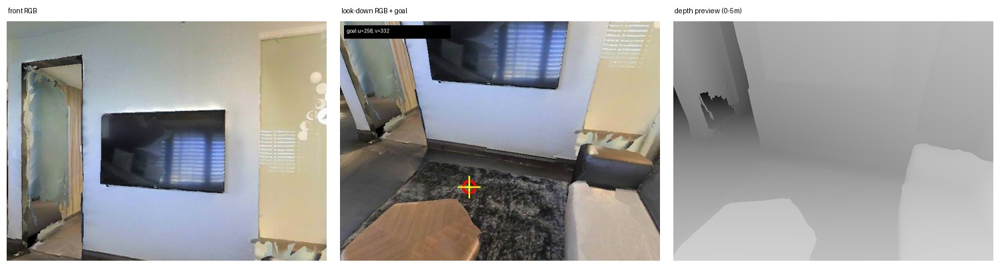

# 真实 R2R → LeRobot → DualVLN 样本检查结果

由 `/workspace/flow/work_space/InternNav/scripts/inspect_vln_training_sample.py` 生成。这里只读原始数据，没有加载模型或修改数据集。

**如果你刚开始学 VLN，请先读 [VLN 小白版：相机 setting、frame、标签和 loss](parquet_schema.md)。**
它从两张真实相机图片讲起，技术性的 56 列表在文末，不需要先看。

## 先看可视化

## 这一条真实数据

- raw R2R：数组下标 `514`，episode_id `515`，trajectory_id `338`。
- LeRobot：scene `17DRP5sb8fy`，episode_index `0`，共 `46` 帧。
- instruction：`Exit the bedroom, enter the bathroom, wait at the toilet.`
- 当前 decision：frame `4`，history `[0, 1, 2, 3]`。
- Qwen 这一条实际看到 `4` 张历史前视图、1 张当前前视图和 1 张当前朝下图，共 `6` 张图。
- Parquet waypoint：`[258, 332]`，即 `u=258`（横向 x），`v=332`（纵向 y）。
- System 2 真值：先输出 `↓`，看朝下图，再输出文本 `258 332`。
- System 1 真值：anchor frames `[4, 6, 8, 10, 12, 14]`，shape `[6, 32, 3]`。
- 只计算本 episode、本相机配置时：Stage A 有 `14` 个 item，Stage B 有 `8` 个 item；这不是整个训练集大小。
- 首个 anchor 的 32 步平移求和后除以 4：`[1.1908297573519622, 0.060246043869053835]`；Parquet local point goal：`[1.19083, 0.060246]`。

raw 与 LeRobot 的 ID 不能直接画等号；这里按同一 scene 和唯一完全相同的 instruction 匹配。

## 可以直接点击的解包文件

- [解压后的 raw R2R episode](raw_r2r_episode_515.json)
- [LeRobot info.json 本地副本](lerobot_info.json)
- [LeRobot episodes.jsonl 本地副本](lerobot_episodes.jsonl)
- [LeRobot episodes_stats.jsonl 本地副本](lerobot_episodes_stats.jsonl)
- [LeRobot tasks.jsonl 本地副本](lerobot_tasks.jsonl)
- [LeRobot episode meta](lerobot_episode_000000.json)
- [LeRobot episode 统计](lerobot_episode_000000_stats.json)
- [LeRobot task 记录](lerobot_task_000000.json)
- [Parquet 全部 46×56 内容 JSONL](parquet_episode_000000_all_46x56.jsonl)
- [这一帧的全部 56 个 Parquet 字段](parquet_frame_000004.json)
- [VLN 小白版：相机 setting、frame、标签和 56 列字典](parquet_schema.md)
- [未经注释的原始 Arrow schema](parquet_schema.txt)
- [46 帧扁平表](frames.csv)
- [10 个 RGB/depth 流索引](media_streams.json)
- [源数据结构 JSON](source_data_tree.json)
- [实际 decision 切分](decision_samples.json)
- [轨迹 GT JSON](trajectory_gt.json)
- [轨迹 GT CSV](trajectory_gt.csv)
- [结构化解释与 loss 公式](sample_summary.json)
- [原始文件路径与 SHA-256](manifest.json)

## 10 个真实相机流的同一 frame 4

- [depth · 125cm_0deg](media_depth_125cm_0deg_frame000004_raw_mm.png)
  - [0～5m 人眼预览](media_depth_125cm_0deg_frame000004_preview_0_5m.png)
- [depth · 125cm_30deg](media_depth_125cm_30deg_frame000004_raw_mm.png)
  - [0～5m 人眼预览](media_depth_125cm_30deg_frame000004_preview_0_5m.png)
- [depth · 125cm_45deg](media_depth_125cm_45deg_frame000004_raw_mm.png)
  - [0～5m 人眼预览](media_depth_125cm_45deg_frame000004_preview_0_5m.png)
- [depth · 60cm_15deg](media_depth_60cm_15deg_frame000004_raw_mm.png)
  - [0～5m 人眼预览](media_depth_60cm_15deg_frame000004_preview_0_5m.png)
- [depth · 60cm_30deg](media_depth_60cm_30deg_frame000004_raw_mm.png)
  - [0～5m 人眼预览](media_depth_60cm_30deg_frame000004_preview_0_5m.png)
- [rgb · 125cm_0deg](media_rgb_125cm_0deg_frame000004.jpg)
- [rgb · 125cm_30deg](media_rgb_125cm_30deg_frame000004.jpg)
- [rgb · 125cm_45deg](media_rgb_125cm_45deg_frame000004.jpg)
- [rgb · 60cm_15deg](media_rgb_60cm_15deg_frame000004.jpg)
- [rgb · 60cm_30deg](media_rgb_60cm_30deg_frame000004.jpg)

## 对应源码

- [Parquet → decision sample → target](../../../../internnav/dataset/internvla_n1_lerobot_dataset.py)
- [u v 文本转内部 row-column](../../../../internnav/model/basemodel/internvla_n1/internvla_n1_policy.py)
- [System 1 Flow Matching loss](../../../../internnav/model/basemodel/internvla_n1/internvla_n1.py)

## Depth 说明

原始 depth 是 16-bit 毫米 PNG；本帧非零范围 `895..5001` mm。`depth_preview_0_5m.png` 只是方便人眼查看的 0～5m 灰度预览，训练仍读取原始 PNG，除以 1000 后截断到 5m；但当前 `nextdit_async` forward/loss 不使用 depth。
