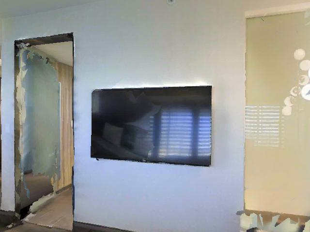
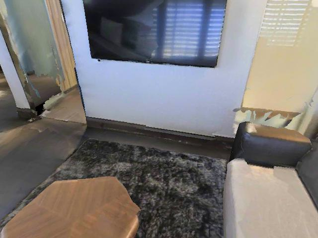
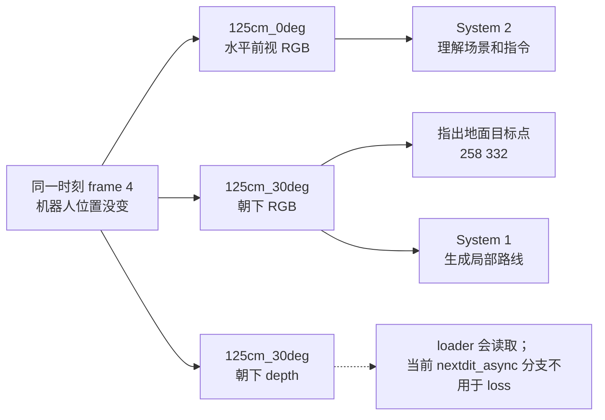

# VLN 小白版：用一个真实 frame 看懂相机 setting、数据和标签

> 这份 Markdown 由 `scripts/inspect_vln_training_sample.py` 根据真实 Parquet 和 frame 4 生成。
> 它是教学文档，不是训练输入。前半部分按小白顺序讲故事；56 列技术表放在最后，第一次阅读不用看。

**第一次阅读建议：读到“7. 到这里你应该懂什么”就停。** 后面只是遇到字段时再查的字典。

## 1. 先把这条数据想成机器人做一道题

人先给机器人一句路线指令：

> `Exit the bedroom, enter the bathroom, wait at the toilet.`

它的大意是：**离开卧室，进入卫生间，并在马桶旁停下**。机器人从开始走到最后停下的完整过程叫一个
**episode（一次完整导航）**。本例 episode 有 **46 个时刻**，编号为 frame 0～45。

这里挑出的 **frame 4** 是从 0 开始数的第 **5 张**观察，时间约为
`4/30 = 0.133` 秒。它不是“第 4 个 episode”，也不是模型标签。

```text
一整道导航题（episode）
├── 路线指令：Exit the bedroom, enter the bathroom, wait at the toilet.
├── frame 0：第 1 个时刻
├── frame 1：第 2 个时刻
├── ...
├── frame 4：本页研究的当前时刻
├── ...
└── frame 45：最后一个时刻
```

一条 episode 会被训练代码拆成很多道小题。每道小题都在问：**机器人看到当前画面后，
接下来该往哪里走？** frame 4 就是其中一道小题的起点。

## 2. `camera setting` 到底是什么

`camera setting` 可以直译成**相机拍摄设置**。这里它只描述两件事：

```text
125cm_30deg
│     └──── 镜头向下俯视 30 度（deg = degree，度）
└────────── 镜头离地 125 厘米
```

所以 `125cm_0deg` 是镜头离地 125 厘米、基本水平看前方；
`125cm_30deg` 是镜头同样离地 125 厘米、但向下俯视 30 度。
它们**不是帧编号，不是机器人转了 30 度，也不是学习率一类的训练超参数**。
在 Habitat 这类模拟数据里，可以把它理解为：在同一个机器人位置，用几台安装姿态不同的
虚拟相机各拍一张照片。

### 同一个 frame 4，为什么有好几张图

下面两张照片来自完全相同的时刻和机器人位置，只是镜头朝向不同。点击图片可打开原图。

| `125cm_0deg`：水平前视 | `125cm_30deg`：向下 30° |
|---|---|
| [](media_rgb_125cm_0deg_frame000004.jpg) | [](media_rgb_125cm_30deg_frame000004.jpg) |
| 看房间、门、走廊，帮助理解语言指令 | 看近处地面，方便指出下一处落脚点 |

前视和朝下的分工是：

- **front（前视）**：回答“我在哪里，门和卫生间大概在哪边”。本样本给 System 2 看
  历史前视 frame 0～3，再看当前 frame 4。
- **look-down（朝下）**：回答“眼下具体踩向地面的哪个点”。图中的目标点会写成像素坐标
  `258 332`；这张图也作为 System 1 生成局部路线的视觉条件。
- `↓` 在模型回答中表示“请切到朝下图继续定位”，**不是让机器人向下移动**。

本 scene 实际保存 5 个 setting，每个 setting 都有一张彩色 RGB 图和一张 depth 距离图，
因此同一 frame 共对应 10 个媒体流：

| setting | 白话解释 | 同一 frame 4 的 RGB 原图 | 本配置是否用 |
|---|---|---|---|
| `125cm_0deg` | 高 125 cm，水平前视 | [打开](media_rgb_125cm_0deg_frame000004.jpg) | **用作 front** |
| `125cm_30deg` | 高 125 cm，向下 30° | [打开](media_rgb_125cm_30deg_frame000004.jpg) | **用作 look-down** |
| `125cm_45deg` | 高 125 cm，向下 45° | [打开](media_rgb_125cm_45deg_frame000004.jpg) | 本配置不用 |
| `60cm_15deg` | 高 60 cm，向下 15° | [打开](media_rgb_60cm_15deg_frame000004.jpg) | 本配置不用 |
| `60cm_30deg` | 高 60 cm，向下 30° | [打开](media_rgb_60cm_30deg_frame000004.jpg) | 本配置不用 |

### setting 和 dataset config 不是同一个东西

一个 `setting` 只代表一个镜头视角，例如 `125cm_30deg`。训练名称
`r2r_125cm_0_30` 则代表一整套数据搭配：

```text
r2r_125cm_0_30
│   │     │  └── look-down 的俯角：30°
│   │     └───── front 的俯角：0°
│   └─────────── 相机高度：125 cm
└─────────────── 数据集：R2R

也就是：front = 125cm_0deg，look-down = 125cm_30deg
```

代码里的 `pitch_1` 就是 front 俯角，`pitch_2` 就是 look-down 俯角。
如果训练脚本写成 `r2r_125cm_0_30%30`，最后的 `%30` 表示随机保留 30% 样本，
与相机的 30° 无关。可直接查看
[相机配置定义源码](../../../../internnav/dataset/internvla_n1_lerobot_dataset.py) 和
[Dual System 训练脚本](../../../../scripts/train/qwenvl_train/train_dual_system.sh)。



一句话记忆：**`125cm_0deg/30deg` 说的是镜头怎么摆；`r2r_125cm_0_30` 说的是
一次训练样本把哪一个前视镜头和哪一个朝下镜头配在一起。**

## 3. 先认识这些词，再看字段

| 词 | 完全不专业的解释 |
|---|---|
| VLN | Vision-Language Navigation：机器人一边看图，一边照着人话找路 |
| instruction | 人给机器人的整句路线指令，不是分类标签 |
| episode | 从起点执行一条 instruction，直到结束的一整次导航 |
| frame / observation | episode 某一时刻机器人看到的图和当时记录的数据 |
| decision sample | 训练代码从某个 frame 加工出的一道“下一步怎么走”小题 |
| camera setting | 相机离地高度和俯视角度，例如 `125cm_30deg` |
| waypoint | 不是最终终点，而是眼下先走到的一个中途落脚点 |
| label / GT | 标准答案；训练时拿模型答案和它比较 |
| loss | 模型答案错了多少的分数；训练就是设法让这个数变小 |
| loader / Dataset | 从硬盘读取数据并把它加工成模型输入与标准答案的代码 |
| Parquet | 一种二进制表格；本例一行对应一个 frame，类似程序高效读取的 Excel |
| pose | 相机当时的位置和朝向，可先把它理解成更完整的“GPS + 指南针” |
| pixel / `[u,v]` | 图像中的一个小点；`u` 从左向右，`v` 从上向下 |
| depth | 每个像素离相机多远的距离图，不是普通彩色照片 |
| token | 模型读写文本时用的基本小块；数字和箭头最终也会变成 token |
| CE / MSE | 两种比较“模型答案”和“标准答案”的算法；前者适合文字，后者适合连续数值 |
| BEV | bird's-eye view，像从天花板向下看的一张局部平面地图 |
| Arrow type | Parquet 在磁盘里怎样保存数字；只查数据格式时才需要看 |
| enrichment | 后处理额外加进表里的辅助字段；当前训练不一定使用 |

## 4. 一道训练小题的数据分别放在哪里

不要误以为 56 列包含了所有内容。instruction、图片和数字表分别住在不同文件里：

```text
episode 0 / frame 4 这道小题
├── 人说了什么
│   └── meta/episodes.jsonl：instruction + episode 有多少帧
├── 机器人看到了什么
│   └── videos/...：不同 camera setting 的 RGB / depth 图片
└── 这一刻的位置和标准答案线索
    └── data/.../episode_000000.parquet：一帧一行的数字表
```

本页已把不方便直接看的容器抽成普通文件：

- [本 episode 的 instruction 和长度](lerobot_episode_000000.json)；
- [frame 4 的全部 56 列真实值](parquet_frame_000004.json)；
- [同一 frame 的前视 RGB](media_rgb_125cm_0deg_frame000004.jpg)；
- [同一 frame 的朝下 RGB](media_rgb_125cm_30deg_frame000004.jpg)；
- [在朝下图上画出 `[258, 332]` 的版本](lookdown_goal_overlay.jpg)；
- [把三种关键图放在一起的总览](overview.jpg)。

## 5. 56 列先别背：当前配置真正取标准答案只看四列

训练代码虽然把整张 56 列表读进内存，但当前 camera config 后续真正索引的只有：

```text
action                              到达当前画面前做了什么动作
pose.125cm_30deg                     相机在哪里、朝哪里
goal.125cm_30deg                     朝下图里的下一落脚点
relative_goal_frame_id.125cm_30deg   还要经过多少帧到这个落脚点
```

### 5.1 `action`：动作记录

frame 4 这一行的 `action=1` 表示机器人**为了到达这张画面**执行的是前进。
训练要问的是“看到这张画面后做什么”，所以代码把动作向前挪一格，读取下一行的
`action=3`，也就是右转。这个动作挪位叫 action shift（动作左移）。

不过当前 frame 有一个有效 waypoint，因此 System 2 不把右转箭头当最终文字答案；它改学
“请求朝下图，然后指出 `258 332`”。只有没有有效 waypoint 的转向样本才直接学箭头。

### 5.2 `goal.125cm_30deg`：朝下图中的目标点

真实值是 `[258, 332]`，顺序为 `[u,v]`：

```text
(0,0) ───────────── u / 横向 / 向右 ────────────> (639,0)
  │
  │
  v  v / 纵向 / 向下
  │
(0,479)

本例 u=258：从左边向右数 258 个像素
本例 v=332：从上边向下数 332 个像素
```

请直接打开 [带十字标记的真实朝下图](lookdown_goal_overlay.jpg)。这个点是**局部 waypoint**，
不是卫生间马桶这个最终任务终点，也不是以米为单位的坐标。

### 5.3 `relative_goal_frame_id.125cm_30deg`：多久到 waypoint

真实值 `11` 的意思是：从当前 frame 4 再向未来走 `11` 帧，会到 frame
`15`。所以代码取 frame 4～15 的 pose，Python 切片写作
`[4:16]`。它是“向未来数几格”，不是绝对 frame ID。

### 5.4 `pose.125cm_30deg`：机器人走过的空间位置

每个 frame 的 pose 是一个 `4×4` 数字矩阵，用来同时记录三维位置和朝向。你现在不必手算矩阵；
只需知道：连续看 frame 4～15 的 pose，就能还原机器人这段真实路线。训练代码再把这条路线
变成“向前多少、向侧面多少、转头多少”的连续运动标准答案。

## 6. 这四列最后怎样变成 Dual System 的两种答案

可以把双系统记成：**System 2 是看图和读指令的“大脑”，System 1 是把意图变成平滑路线的‘腿’。**

### System 2：学会用文字回答下一步

1. 它先看历史前视 frame 0～3、当前前视 frame 4 和 instruction。
2. 标准答案先是 `↓`，意思是“我需要朝下图来精确找落脚点”。
3. 加入当前 `125cm_30deg` 朝下图后，标准答案是文本 `258 332`。
4. 训练只检查模型自己回答的这些文字小块（token），不要求它复述 instruction，也不把图片当答案。
5. CE loss 可以理解成：正确文字的概率越低，扣分越多。

### System 1：学会画出连续局部路线

1. 从 pose 中取 frame 4～15 的真实移动。
2. 每隔 2 帧选一个重新规划起点，本例为 `[4, 6, 8, 10, 12, 14]`。这些起点叫 anchor。
3. 从每个 anchor 往后，把路线整理成 32 个小步；每步 3 个数：向前/侧面位移和转角。
4. 本例最终标准答案 shape 是 `[6,32,3]`：6 个 anchor × 32 个小步 × 每步 3 个数。
5. 训练先给真实路线加噪声，再让 NextDiT 学会去掉噪声、恢复正确运动方向；MSE loss
   可以理解成逐个数字比较预测与标准答案，差得越远扣分越多。

这两种 loss 属于两个训练阶段：System 2 阶段学文本 CE，Dual/System 1 阶段学轨迹 Flow MSE；
不是把两项随手加在同一次 forward 里。

```text
instruction + 前视图片
          │
          ▼
System 2 标准答案：↓  →  看朝下图  →  258 332
                                             │
                                             ▼
pose frame 4～15 ───────────────> System 1 标准答案 [6,32,3] 局部路线
```

## 7. 到这里你应该懂什么

读完前面，只要能回答下面 6 句，就已经足够继续看训练代码：

1. 一个 episode 是一次完整导航；一个 frame 只是其中一个时刻。
2. 同一 frame 可以从不同 camera setting 同时拍摄，机器人位置并没有变化。
3. 当前配置用 `125cm_0deg` 看前方，用 `125cm_30deg` 看近处地面。
4. `[u,v]=[258,332]` 是朝下图中的中途落脚点，不是最终终点。
5. `11` 表示从 frame 4 向未来数 11 帧，不是 frame ID。
6. System 2 学文字/坐标，System 1 学连续路线。

**第一次阅读可以在这里停下。** 下面是为了逐字段排查代码和数据而保留的技术字典。

---

## 8. 技术追踪：frame 4 的四列怎样变成监督

这一节把上面的白话和源码术语一一对应。遇到 `loader`、`CE`、`GT` 时可回看第 3 节词表。

可直接打开的相关文件：

- [frame 4 的全部 56 列实值](parquet_frame_000004.json)
- [episode 0 全部 46×56 数据](parquet_episode_000000_all_46x56.jsonl)
- [46 帧教学表](frames.csv)
- [meta/info.json](lerobot_info.json)
- [未经注释的原始 Arrow schema](parquet_schema.txt)
- [本样本和 loss 摘要](sample_summary.json)
- [Dataset 读取和标签构造源码](../../../../internnav/dataset/internvla_n1_lerobot_dataset.py)
- [推理时 `u v → [v,u]` 的源码](../../../../internnav/model/basemodel/internvla_n1/internvla_n1_policy.py)

原始二进制文件位于：

```text
/mnt/cpfs/zbl-cpfs-new/open_data/InternData-N1/vln_ce/traj_data/r2r/17DRP5sb8fy/data/chunk-000/episode_000000.parquet
```

文件有 **56 个顶层列**。但是当前 `front=125cm_0deg, look-down=125cm_30deg` 配置实际用来构造训练样本的只有：

```text
action
pose.125cm_30deg
goal.125cm_30deg
relative_goal_frame_id.125cm_30deg
```

当前 `pq.read_table()` 没有限制 `columns=`，所以 56 列仍会全部读进内存；“只用四列”表示
后续训练逻辑只显式索引这四列。换一个 camera config 时，会改用对应 setting 的三列。
`meta/info.json` 声明了 21 列，实际 Parquet 另外包含 35 个后处理 enrichment 字段。

| 字段 | frame 4 实值 | 处理 | 最终作用 |
|---|---|---|---|
| `action` | 本行 `1`，下一行 `3` | 执行 `actions[1:] + [0]`，让当前观察对齐下一动作 | 用于 turn/STOP 分支；本帧有有效 waypoint，所以最终输出不是这个箭头 |
| `pose.125cm_30deg` | `[4,4]` | 截取 frame 4～15，转成 anchor 局部轨迹并重采样 | System 1 的 `[F,32,3]` Flow trajectory GT |
| `goal.125cm_30deg` | `[258, 332]` | 保持 `[u,v]` 顺序并转成文本 | System 2 在 `↓` 后的 token CE 标签 `258 332` |
| `relative_goal_frame_id.125cm_30deg` | `11` | 解释为未来 offset；pose slice 为 `[4:16]` | 决定样本有效性、轨迹窗口和 anchor 数；本身不是回归标签 |

因此本帧 System 2 的监督是：先生成 `↓`，看到朝下图后再生成 `258 332`。

## 9. 为什么会有 56 列

同一条路线为 5 种 camera setting 都预先保存了 pose、goal 和 horizon；数据制作流程还追加了
一些备用目标和 prompt。所以列数看起来很多，并不表示模型同时预测 56 个答案。当前配置只
从所选 look-down setting 取 3 列，再加 `action`，其余字段第一次阅读都可以跳过。

| 组 | 列号 | 数量 | 内容 | 当前 loader |
|---|---|---|---|---|
| A | 1 | 1 | 离散 action | 使用 |
| B | 2–16 | 15 | 5 × (`pose`, `goal`, `relative_goal_frame_id`) | 每个配置使用所选 setting 的 3 列 |
| C | 17–21 | 5 | LeRobot 时间和索引 | 不使用 |
| D | 22–31 | 10 | 5 × (`local_point_goal`, prompt) | 不使用 |
| E | 32–36 | 5 | 5 × `final_point_goal` | 不使用 |
| F | 37–41 | 5 | 5 × 完整 `goal_prompt` | 不使用 |
| G | 42–56 | 15 | 5 × (`action_pixel_goal`, type, prompt) | 不使用 |
| 合计 | 1–56 | 56 | 21 个基础字段 + 35 个 enrichment 字段 | 当前配置语义使用 4 列 |

## 附录 A：56 列逐列查字典

下面保证 56 列一列不少，适合排查代码时搜索字段名。`Arrow 类型` 只是在说明硬盘如何保存
数字；`当前 loader` 是在说明训练读取代码是否真正把这一列加工成输入或标签。无需通读。

### A1. 离散动作（列 1）

`action` 是到达当前 observation 时记录的动作；loader 左移后才得到当前观察对应的下一动作。

| # / 字段 | 磁盘类型 / 形状（可跳过） | frame 4 实值 | 白话含义 | 训练读取代码是否用 |
|---|---|---|---|---|
| [01] `action` | `int32`；标量（meta/info.json 逻辑声明为 [1]）<br>来源：meta/info.json 已声明 | `1` | 到达本行 observation 时记录的原始离散动作。本 episode 实际值为 -1=START/INVALID、1=↑/forward、2=←/left、3=→/right；loader 在左移后给末尾人工补 0=STOP。代码的对话映射还定义 5=↓/look-down，但它是模型的两轮输出符号，不是本 episode 存储的基础动作。训练 loader 做 actions[1:] + [0]，所以决策帧 t 的“下一动作”来自原始行 t+1。 | 使用；主要构造转向/STOP 样本。若本帧有有效 pixel goal，System 2 监督仍是 ↓ 后接 u v，不是这一个 action 数字。 |

### A2. 五种相机设置的 pose / goal / horizon（列 2–16）

五套 setting 属于同一条轨迹，不是五个 episode。每个配置只选择一套 look-down setting。

| # / 字段 | 磁盘类型 / 形状（可跳过） | frame 4 实值 | 白话含义 | 训练读取代码是否用 |
|---|---|---|---|---|
| [02] `pose.125cm_0deg` | `list<element: list<element: float>>`；[4,4]（Arrow 本身是可变长嵌套 list）<br>来源：meta/info.json 已声明 | `4×4 矩阵；平移列前三项=[0.1768, -0.1768, 1.25]（完整矩阵见 parquet_frame_*.json）` | 相机配置 125cm_0deg 的 4×4 float32 变换矩阵；平移量以米计。训练代码把未来一段 pose 交给 get_trajectory_relative_to_frame()，转成各 anchor 局部坐标中的轨迹。源码注释称它为 T_world2camera；仅凭 Parquet schema 不应继续推断矩阵方向。 | 本配置不使用；选择 look-down setting=125cm_0deg 的配置时才使用。 |
| [03] `goal.125cm_0deg` | `list<element: int32>`；[2]<br>来源：meta/info.json 已声明 | `[-1, -1]` | 相机配置 125cm_0deg 中的局部 waypoint 像素坐标 [u,v]：u 是横向列/x（0～639），v 是纵向行/y（0～479）；[-1,-1] 表示该设置下没有有效可见 waypoint。 | 本配置不使用；选择 look-down setting=125cm_0deg 的配置时才使用。 |
| [04] `relative_goal_frame_id.125cm_0deg` | `int32`；标量（未来 frame offset）<br>来源：meta/info.json 已声明 | `-1` | 相机配置 125cm_0deg 的 waypoint 未来帧偏移 h，不是绝对 frame ID。h=-1 表示无有效 pixel goal；有效时当前帧 4 使用 pose[t:t+h+1]，h<3 的样本会被丢弃。 | 本配置不使用；选择 look-down setting=125cm_0deg 的配置时才使用。 |
| [05] `pose.125cm_30deg` | `list<element: list<element: float>>`；[4,4]（Arrow 本身是可变长嵌套 list）<br>来源：meta/info.json 已声明 | `4×4 矩阵；平移列前三项=[0.1768, -0.1768, 1.25]（完整矩阵见 parquet_frame_*.json）` | 相机配置 125cm_30deg 的 4×4 float32 变换矩阵；平移量以米计。训练代码把未来一段 pose 交给 get_trajectory_relative_to_frame()，转成各 anchor 局部坐标中的轨迹。源码注释称它为 T_world2camera；仅凭 Parquet schema 不应继续推断矩阵方向。 | 使用：为 System 1 派生 [F,32,3] Flow 轨迹 GT。 |
| [06] `goal.125cm_30deg` | `list<element: int32>`；[2]<br>来源：meta/info.json 已声明 | `[258, 332]` | 相机配置 125cm_30deg 中的局部 waypoint 像素坐标 [u,v]：u 是横向列/x（0～639），v 是纵向行/y（0～479）；[-1,-1] 表示该设置下没有有效可见 waypoint。 | 使用：直接成为 System 2 在 ↓ 后生成的文本 `u v`，按 token CE 训练，不是二维回归。 |
| [07] `relative_goal_frame_id.125cm_30deg` | `int32`；标量（未来 frame offset）<br>来源：meta/info.json 已声明 | `11` | 相机配置 125cm_30deg 的 waypoint 未来帧偏移 h，不是绝对 frame ID。h=-1 表示无有效 pixel goal；有效时当前帧 4 使用 pose[t:t+h+1]，h<3 的样本会被丢弃。 | 使用：决定样本类型、pose 切片终点和 System 1 anchor 数量；它本身不是回归标签。 |
| [08] `pose.125cm_45deg` | `list<element: list<element: float>>`；[4,4]（Arrow 本身是可变长嵌套 list）<br>来源：meta/info.json 已声明 | `4×4 矩阵；平移列前三项=[0.1768, -0.1768, 1.25]（完整矩阵见 parquet_frame_*.json）` | 相机配置 125cm_45deg 的 4×4 float32 变换矩阵；平移量以米计。训练代码把未来一段 pose 交给 get_trajectory_relative_to_frame()，转成各 anchor 局部坐标中的轨迹。源码注释称它为 T_world2camera；仅凭 Parquet schema 不应继续推断矩阵方向。 | 本配置不使用；选择 look-down setting=125cm_45deg 的配置时才使用。 |
| [09] `goal.125cm_45deg` | `list<element: int32>`；[2]<br>来源：meta/info.json 已声明 | `[218, 211]` | 相机配置 125cm_45deg 中的局部 waypoint 像素坐标 [u,v]：u 是横向列/x（0～639），v 是纵向行/y（0～479）；[-1,-1] 表示该设置下没有有效可见 waypoint。 | 本配置不使用；选择 look-down setting=125cm_45deg 的配置时才使用。 |
| [10] `relative_goal_frame_id.125cm_45deg` | `int32`；标量（未来 frame offset）<br>来源：meta/info.json 已声明 | `12` | 相机配置 125cm_45deg 的 waypoint 未来帧偏移 h，不是绝对 frame ID。h=-1 表示无有效 pixel goal；有效时当前帧 4 使用 pose[t:t+h+1]，h<3 的样本会被丢弃。 | 本配置不使用；选择 look-down setting=125cm_45deg 的配置时才使用。 |
| [11] `pose.60cm_15deg` | `list<element: list<element: float>>`；[4,4]（Arrow 本身是可变长嵌套 list）<br>来源：meta/info.json 已声明 | `4×4 矩阵；平移列前三项=[0.1768, -0.1768, 0.6]（完整矩阵见 parquet_frame_*.json）` | 相机配置 60cm_15deg 的 4×4 float32 变换矩阵；平移量以米计。训练代码把未来一段 pose 交给 get_trajectory_relative_to_frame()，转成各 anchor 局部坐标中的轨迹。源码注释称它为 T_world2camera；仅凭 Parquet schema 不应继续推断矩阵方向。 | 本配置不使用；选择 look-down setting=60cm_15deg 的配置时才使用。 |
| [12] `goal.60cm_15deg` | `list<element: int32>`；[2]<br>来源：meta/info.json 已声明 | `[115, 222]` | 相机配置 60cm_15deg 中的局部 waypoint 像素坐标 [u,v]：u 是横向列/x（0～639），v 是纵向行/y（0～479）；[-1,-1] 表示该设置下没有有效可见 waypoint。 | 本配置不使用；选择 look-down setting=60cm_15deg 的配置时才使用。 |
| [13] `relative_goal_frame_id.60cm_15deg` | `int32`；标量（未来 frame offset）<br>来源：meta/info.json 已声明 | `22` | 相机配置 60cm_15deg 的 waypoint 未来帧偏移 h，不是绝对 frame ID。h=-1 表示无有效 pixel goal；有效时当前帧 4 使用 pose[t:t+h+1]，h<3 的样本会被丢弃。 | 本配置不使用；选择 look-down setting=60cm_15deg 的配置时才使用。 |
| [14] `pose.60cm_30deg` | `list<element: list<element: float>>`；[4,4]（Arrow 本身是可变长嵌套 list）<br>来源：meta/info.json 已声明 | `4×4 矩阵；平移列前三项=[0.1768, -0.1768, 0.6]（完整矩阵见 parquet_frame_*.json）` | 相机配置 60cm_30deg 的 4×4 float32 变换矩阵；平移量以米计。训练代码把未来一段 pose 交给 get_trajectory_relative_to_frame()，转成各 anchor 局部坐标中的轨迹。源码注释称它为 T_world2camera；仅凭 Parquet schema 不应继续推断矩阵方向。 | 本配置不使用；选择 look-down setting=60cm_30deg 的配置时才使用。 |
| [15] `goal.60cm_30deg` | `list<element: int32>`；[2]<br>来源：meta/info.json 已声明 | `[298, 212]` | 相机配置 60cm_30deg 中的局部 waypoint 像素坐标 [u,v]：u 是横向列/x（0～639），v 是纵向行/y（0～479）；[-1,-1] 表示该设置下没有有效可见 waypoint。 | 本配置不使用；选择 look-down setting=60cm_30deg 的配置时才使用。 |
| [16] `relative_goal_frame_id.60cm_30deg` | `int32`；标量（未来 frame offset）<br>来源：meta/info.json 已声明 | `10` | 相机配置 60cm_30deg 的 waypoint 未来帧偏移 h，不是绝对 frame ID。h=-1 表示无有效 pixel goal；有效时当前帧 4 使用 pose[t:t+h+1]，h<3 的样本会被丢弃。 | 本配置不使用；选择 look-down setting=60cm_30deg 的配置时才使用。 |

### A3. LeRobot 时间和索引（列 17–21）

这些字段用于数据格式记账；当前 loader 的 instruction、episode ID 和 length 来自 `meta/episodes.jsonl`。

| # / 字段 | 磁盘类型 / 形状（可跳过） | frame 4 实值 | 白话含义 | 训练读取代码是否用 |
|---|---|---|---|---|
| [17] `timestamp` | `float`；标量，秒<br>来源：meta/info.json 已声明 | `0.13333334028720856` | episode 内时间戳，通常等于 frame_index / FPS；本例 FPS=30。 | 当前 InternVLA loader 不使用；instruction/episode/length 来自 meta/episodes.jsonl，帧顺序直接采用 Parquet 行顺序。 |
| [18] `frame_index` | `int64`；标量<br>来源：meta/info.json 已声明 | `4` | episode 内从 0 开始的帧号。 | 当前 InternVLA loader 不使用；instruction/episode/length 来自 meta/episodes.jsonl，帧顺序直接采用 Parquet 行顺序。 |
| [19] `episode_index` | `int64`；标量<br>来源：meta/info.json 已声明 | `0` | 当前 scene 的 LeRobot episode 编号；它不等于 raw R2R episode_id。 | 当前 InternVLA loader 不使用；instruction/episode/length 来自 meta/episodes.jsonl，帧顺序直接采用 Parquet 行顺序。 |
| [20] `index` | `int64`；标量<br>来源：meta/info.json 已声明 | `4` | 该 scene 级 LeRobot 数据集内跨 episode 累计的全局行号。 | 当前 InternVLA loader 不使用；instruction/episode/length 来自 meta/episodes.jsonl，帧顺序直接采用 Parquet 行顺序。 |
| [21] `task_index` | `int64`；标量<br>来源：meta/info.json 已声明 | `0` | 指向 meta/tasks.jsonl 的 task_index，用来把整数还原为任务文本。 | 当前 InternVLA loader 不使用；instruction/episode/length 来自 meta/episodes.jsonl，帧顺序直接采用 Parquet 行顺序。 |

### A4. local point goal 与 prompt（列 22–31）

`local_point_goal` 是机器人局部 BEV `[x,y]`，单位米；配套 prompt 把同一数值写入问句。当前 loader 不读取。

| # / 字段 | 磁盘类型 / 形状（可跳过） | frame 4 实值 | 白话含义 | 训练读取代码是否用 |
|---|---|---|---|---|
| [22] `local_point_goal.60cm_30deg` | `list<element: double>`；[2]，float64<br>来源：Parquet enrichment；meta 未声明 | `[1.19083, 0.060246]` | 额外 enrichment：从当前机器人坐标看 60cm_30deg 局部 waypoint 的 BEV [x,y]，单位米；对应 prompt 把当前位置写成 (0,0)、heading 写成 (1,0)。 | 当前 InternVLA loader 完全不读取；检查脚本只用它核对由 pose 派生的轨迹位移。 |
| [23] `local_point_goal_prompt.60cm_30deg` | `string`；字符串标量<br>来源：Parquet enrichment；meta 未声明 | 字符串，共 259 字符；全文见 frame JSON | 额外 enrichment：把 60cm_30deg 的 local BEV target 和允许动作写进自然语言模板。 | 当前 InternVLA loader 完全不读取；它使用 episode instruction 在 __getitem__() 中另建 prompt。 |
| [24] `local_point_goal.125cm_45deg` | `list<element: double>`；[2]，float64<br>来源：Parquet enrichment；meta 未声明 | `[1.315926, 0.276764]` | 额外 enrichment：从当前机器人坐标看 125cm_45deg 局部 waypoint 的 BEV [x,y]，单位米；对应 prompt 把当前位置写成 (0,0)、heading 写成 (1,0)。 | 当前 InternVLA loader 完全不读取；检查脚本只用它核对由 pose 派生的轨迹位移。 |
| [25] `local_point_goal_prompt.125cm_45deg` | `string`；字符串标量<br>来源：Parquet enrichment；meta 未声明 | 字符串，共 271 字符；全文见 frame JSON | 额外 enrichment：把 125cm_45deg 的 local BEV target 和允许动作写进自然语言模板。 | 当前 InternVLA loader 完全不读取；它使用 episode instruction 在 __getitem__() 中另建 prompt。 |
| [26] `local_point_goal.125cm_30deg` | `list<element: double>`；[2]，float64<br>来源：Parquet enrichment；meta 未声明 | `[1.19083, 0.060246]` | 额外 enrichment：从当前机器人坐标看 125cm_30deg 局部 waypoint 的 BEV [x,y]，单位米；对应 prompt 把当前位置写成 (0,0)、heading 写成 (1,0)。 | 当前 InternVLA loader 完全不读取；检查脚本只用它核对由 pose 派生的轨迹位移。 |
| [27] `local_point_goal_prompt.125cm_30deg` | `string`；字符串标量<br>来源：Parquet enrichment；meta 未声明 | 字符串，共 274 字符；全文见 frame JSON | 额外 enrichment：把 125cm_30deg 的 local BEV target 和允许动作写进自然语言模板。 | 当前 InternVLA loader 完全不读取；它使用 episode instruction 在 __getitem__() 中另建 prompt。 |
| [28] `local_point_goal.60cm_15deg` | `list<element: double>`；[2]，float64<br>来源：Parquet enrichment；meta 未声明 | `[2.359243, 1.167869]` | 额外 enrichment：从当前机器人坐标看 60cm_15deg 局部 waypoint 的 BEV [x,y]，单位米；对应 prompt 把当前位置写成 (0,0)、heading 写成 (1,0)。 | 当前 InternVLA loader 完全不读取；检查脚本只用它核对由 pose 派生的轨迹位移。 |
| [29] `local_point_goal_prompt.60cm_15deg` | `string`；字符串标量<br>来源：Parquet enrichment；meta 未声明 | 字符串，共 275 字符；全文见 frame JSON | 额外 enrichment：把 60cm_15deg 的 local BEV target 和允许动作写进自然语言模板。 | 当前 InternVLA loader 完全不读取；它使用 episode instruction 在 __getitem__() 中另建 prompt。 |
| [30] `local_point_goal.125cm_0deg` | `list<element: double>`；[2]，float64<br>来源：Parquet enrichment；meta 未声明 | `[3.500212, 0.728044]` | 额外 enrichment：从当前机器人坐标看 125cm_0deg 局部 waypoint 的 BEV [x,y]，单位米；对应 prompt 把当前位置写成 (0,0)、heading 写成 (1,0)。 | 当前 InternVLA loader 完全不读取；检查脚本只用它核对由 pose 派生的轨迹位移。 |
| [31] `local_point_goal_prompt.125cm_0deg` | `string`；字符串标量<br>来源：Parquet enrichment；meta 未声明 | 字符串，共 261 字符；全文见 frame JSON | 额外 enrichment：把 125cm_0deg 的 local BEV target 和允许动作写进自然语言模板。 | 当前 InternVLA loader 完全不读取；它使用 episode instruction 在 __getitem__() 中另建 prompt。 |

### A5. final point goal（列 32–36）

表示从当前机器人坐标看 episode 最后一帧位置的 BEV `[x,y]`，单位米；不是五个不同 Habitat goal。

| # / 字段 | 磁盘类型 / 形状（可跳过） | frame 4 实值 | 白话含义 | 训练读取代码是否用 |
|---|---|---|---|---|
| [32] `final_point_goal.60cm_30deg` | `list<element: double>`；[2]，float64<br>来源：Parquet enrichment；meta 未声明 | `[5.957189, 0.404539]` | 额外 enrichment：从当前机器人坐标看 episode 最后一帧在 60cm_30deg 下的 BEV [x,y]，单位米；它不是五个不同的 Habitat goal。 | 当前 InternVLA loader 完全不读取。 |
| [33] `final_point_goal.125cm_45deg` | `list<element: double>`；[2]，float64<br>来源：Parquet enrichment；meta 未声明 | `[5.957587, 0.404539]` | 额外 enrichment：从当前机器人坐标看 episode 最后一帧在 125cm_45deg 下的 BEV [x,y]，单位米；它不是五个不同的 Habitat goal。 | 当前 InternVLA loader 完全不读取。 |
| [34] `final_point_goal.125cm_30deg` | `list<element: double>`；[2]，float64<br>来源：Parquet enrichment；meta 未声明 | `[5.957189, 0.404539]` | 额外 enrichment：从当前机器人坐标看 episode 最后一帧在 125cm_30deg 下的 BEV [x,y]，单位米；它不是五个不同的 Habitat goal。 | 当前 InternVLA loader 完全不读取。 |
| [35] `final_point_goal.60cm_15deg` | `list<element: double>`；[2]，float64<br>来源：Parquet enrichment；meta 未声明 | `[5.957718, 0.404539]` | 额外 enrichment：从当前机器人坐标看 episode 最后一帧在 60cm_15deg 下的 BEV [x,y]，单位米；它不是五个不同的 Habitat goal。 | 当前 InternVLA loader 完全不读取。 |
| [36] `final_point_goal.125cm_0deg` | `list<element: double>`；[2]，float64<br>来源：Parquet enrichment；meta 未声明 | `[5.957644, 0.404539]` | 额外 enrichment：从当前机器人坐标看 episode 最后一帧在 125cm_0deg 下的 BEV [x,y]，单位米；它不是五个不同的 Habitat goal。 | 当前 InternVLA loader 完全不读取。 |

### A6. 完整两阶段 prompt（列 37–41）

模板写入 local/final BEV point，并要求先选动作、若选 `↓` 再输出 `u v`。正式 loader 不读取这些字符串。

| # / 字段 | 磁盘类型 / 形状（可跳过） | frame 4 实值 | 白话含义 | 训练读取代码是否用 |
|---|---|---|---|---|
| [37] `goal_prompt.60cm_30deg` | `string`；字符串标量<br>来源：Parquet enrichment；meta 未声明 | 字符串，共 381 字符；全文见 frame JSON | 额外 enrichment：60cm_30deg 的完整两阶段模板，先选符号动作，若选择 ↓ 再输出 u v。 | 当前 InternVLA loader 完全不读取；正式训练 prompt 由代码重新构造。 |
| [38] `goal_prompt.125cm_45deg` | `string`；字符串标量<br>来源：Parquet enrichment；meta 未声明 | 字符串，共 382 字符；全文见 frame JSON | 额外 enrichment：125cm_45deg 的完整两阶段模板，先选符号动作，若选择 ↓ 再输出 u v。 | 当前 InternVLA loader 完全不读取；正式训练 prompt 由代码重新构造。 |
| [39] `goal_prompt.125cm_30deg` | `string`；字符串标量<br>来源：Parquet enrichment；meta 未声明 | 字符串，共 381 字符；全文见 frame JSON | 额外 enrichment：125cm_30deg 的完整两阶段模板，先选符号动作，若选择 ↓ 再输出 u v。 | 当前 InternVLA loader 完全不读取；正式训练 prompt 由代码重新构造。 |
| [40] `goal_prompt.60cm_15deg` | `string`；字符串标量<br>来源：Parquet enrichment；meta 未声明 | 字符串，共 382 字符；全文见 frame JSON | 额外 enrichment：60cm_15deg 的完整两阶段模板，先选符号动作，若选择 ↓ 再输出 u v。 | 当前 InternVLA loader 完全不读取；正式训练 prompt 由代码重新构造。 |
| [41] `goal_prompt.125cm_0deg` | `string`；字符串标量<br>来源：Parquet enrichment；meta 未声明 | 字符串，共 382 字符；全文见 frame JSON | 额外 enrichment：125cm_0deg 的完整两阶段模板，先选符号动作，若选择 ↓ 再输出 u v。 | 当前 InternVLA loader 完全不读取；正式训练 prompt 由代码重新构造。 |

### A7. action-conditioned pixel goal（列 42–56）

这是另一组 enrichment。它与正式使用的 `goal.<setting>` 不是全局同义字段，当前 loader 完全不读取。

| # / 字段 | 磁盘类型 / 形状（可跳过） | frame 4 实值 | 白话含义 | 训练读取代码是否用 |
|---|---|---|---|---|
| [42] `action_pixel_goal.60cm_30deg` | `list<element: int64>`；[2]，int64<br>来源：Parquet enrichment；meta 未声明 | `[298, 212]` | 额外 enrichment：60cm_30deg 的 action-conditioned 像素目标。实测 forward 且 waypoint 有效时常等于 goal，left/right 常取图像左右边缘，invalid 为 [-1,-1]；它与 goal 不是全局同义字段。 | 当前 InternVLA loader 完全不读取，不能拿它替代 goal.<setting>。 |
| [43] `action_pixel_goal_type.60cm_30deg` | `string`；字符串标量<br>来源：Parquet enrichment；meta 未声明 | `"forward"` | 额外 enrichment：描述 action_pixel_goal.60cm_30deg 的类别，真实数据可见 forward/left/right/invalid。仓库缺少生成这 35 个 enrichment 字段的原脚本，故这里不臆测更多规则。 | 当前 InternVLA loader 完全不读取。 |
| [44] `goal_prompt_pixel.60cm_30deg` | `string`；字符串标量<br>来源：Parquet enrichment；meta 未声明 | 字符串，共 114 字符；全文见 frame JSON | 额外 enrichment：60cm_30deg 的简短 prompt 前缀，写入 current/local/final BEV point。 | 当前 InternVLA loader 完全不读取。 |
| [45] `action_pixel_goal.125cm_45deg` | `list<element: int64>`；[2]，int64<br>来源：Parquet enrichment；meta 未声明 | `[218, 211]` | 额外 enrichment：125cm_45deg 的 action-conditioned 像素目标。实测 forward 且 waypoint 有效时常等于 goal，left/right 常取图像左右边缘，invalid 为 [-1,-1]；它与 goal 不是全局同义字段。 | 当前 InternVLA loader 完全不读取，不能拿它替代 goal.<setting>。 |
| [46] `action_pixel_goal_type.125cm_45deg` | `string`；字符串标量<br>来源：Parquet enrichment；meta 未声明 | `"forward"` | 额外 enrichment：描述 action_pixel_goal.125cm_45deg 的类别，真实数据可见 forward/left/right/invalid。仓库缺少生成这 35 个 enrichment 字段的原脚本，故这里不臆测更多规则。 | 当前 InternVLA loader 完全不读取。 |
| [47] `goal_prompt_pixel.125cm_45deg` | `string`；字符串标量<br>来源：Parquet enrichment；meta 未声明 | 字符串，共 115 字符；全文见 frame JSON | 额外 enrichment：125cm_45deg 的简短 prompt 前缀，写入 current/local/final BEV point。 | 当前 InternVLA loader 完全不读取。 |
| [48] `action_pixel_goal.125cm_30deg` | `list<element: int64>`；[2]，int64<br>来源：Parquet enrichment；meta 未声明 | `[258, 332]` | 额外 enrichment：125cm_30deg 的 action-conditioned 像素目标。实测 forward 且 waypoint 有效时常等于 goal，left/right 常取图像左右边缘，invalid 为 [-1,-1]；它与 goal 不是全局同义字段。 | 当前 InternVLA loader 完全不读取，不能拿它替代 goal.<setting>。 |
| [49] `action_pixel_goal_type.125cm_30deg` | `string`；字符串标量<br>来源：Parquet enrichment；meta 未声明 | `"forward"` | 额外 enrichment：描述 action_pixel_goal.125cm_30deg 的类别，真实数据可见 forward/left/right/invalid。仓库缺少生成这 35 个 enrichment 字段的原脚本，故这里不臆测更多规则。 | 当前 InternVLA loader 完全不读取。 |
| [50] `goal_prompt_pixel.125cm_30deg` | `string`；字符串标量<br>来源：Parquet enrichment；meta 未声明 | 字符串，共 114 字符；全文见 frame JSON | 额外 enrichment：125cm_30deg 的简短 prompt 前缀，写入 current/local/final BEV point。 | 当前 InternVLA loader 完全不读取。 |
| [51] `action_pixel_goal.60cm_15deg` | `list<element: int64>`；[2]，int64<br>来源：Parquet enrichment；meta 未声明 | `[115, 222]` | 额外 enrichment：60cm_15deg 的 action-conditioned 像素目标。实测 forward 且 waypoint 有效时常等于 goal，left/right 常取图像左右边缘，invalid 为 [-1,-1]；它与 goal 不是全局同义字段。 | 当前 InternVLA loader 完全不读取，不能拿它替代 goal.<setting>。 |
| [52] `action_pixel_goal_type.60cm_15deg` | `string`；字符串标量<br>来源：Parquet enrichment；meta 未声明 | `"forward"` | 额外 enrichment：描述 action_pixel_goal.60cm_15deg 的类别，真实数据可见 forward/left/right/invalid。仓库缺少生成这 35 个 enrichment 字段的原脚本，故这里不臆测更多规则。 | 当前 InternVLA loader 完全不读取。 |
| [53] `goal_prompt_pixel.60cm_15deg` | `string`；字符串标量<br>来源：Parquet enrichment；meta 未声明 | 字符串，共 115 字符；全文见 frame JSON | 额外 enrichment：60cm_15deg 的简短 prompt 前缀，写入 current/local/final BEV point。 | 当前 InternVLA loader 完全不读取。 |
| [54] `action_pixel_goal.125cm_0deg` | `list<element: int64>`；[2]，int64<br>来源：Parquet enrichment；meta 未声明 | `[-1, -1]` | 额外 enrichment：125cm_0deg 的 action-conditioned 像素目标。实测 forward 且 waypoint 有效时常等于 goal，left/right 常取图像左右边缘，invalid 为 [-1,-1]；它与 goal 不是全局同义字段。 | 当前 InternVLA loader 完全不读取，不能拿它替代 goal.<setting>。 |
| [55] `action_pixel_goal_type.125cm_0deg` | `string`；字符串标量<br>来源：Parquet enrichment；meta 未声明 | `"invalid"` | 额外 enrichment：描述 action_pixel_goal.125cm_0deg 的类别，真实数据可见 forward/left/right/invalid。仓库缺少生成这 35 个 enrichment 字段的原脚本，故这里不臆测更多规则。 | 当前 InternVLA loader 完全不读取。 |
| [56] `goal_prompt_pixel.125cm_0deg` | `string`；字符串标量<br>来源：Parquet enrichment；meta 未声明 | 字符串，共 115 字符；全文见 frame JSON | 额外 enrichment：125cm_0deg 的简短 prompt 前缀，写入 current/local/final BEV point。 | 当前 InternVLA loader 完全不读取。 |

<details>
<summary>展开 frame 4 / 125cm_30deg 的三种真实 prompt 全文</summary>

#### [27] `local_point_goal_prompt.125cm_30deg`

```text
From BEV position (0,0) and heading vector (1,0), target position=(1.19083, 0.060246). Where should you go next to the target position and stay on track? Please return the image coordinates of the target and the next action. The action should be ['STOP', '↑', '←', '→', '↓']
```

#### [39] `goal_prompt.125cm_30deg`

```text
Your current pose: BEV=(0,0), heading=(1,0). Local target: (1.19083, 0.060246), final goal: (5.957189, 0.404539). Step 1: Choose the next action(s) from ['STOP', '↑', '←', '→', '↓'] to move toward the local target. Output STOP if you have reached the final goal. Step 2: If you chose '↓' in Step 1, locate the local target in the next image and output its pixel coordinates as u v.
```

#### [50] `goal_prompt_pixel.125cm_30deg`

```text
Your current pose: BEV=(0,0), heading=(1,0). Local target: (1.19083, 0.060246), final goal: (5.957189, 0.404539). 
```

</details>

## 附录 B：最容易误解的地方

1. **56 是顶层列数。** Raw schema 中缩进的 `child/element` 是 list 子类型，不是额外列。
2. **Arrow list 不强制固定 shape。** `[4,4]` 和 `[2]` 是 meta 逻辑约定及真实数据形状。
3. **`goal=[u,v]`。** `u` 是横向列/x，`v` 是纵向行/y，不是 `[row,column]`。
4. **horizon 是未来 offset。** frame 4 的 11 对应 frame 15，pose slice 是 `[4:16]`。
5. **action 会左移。** frame 4 原值为 1，而它的下一动作来自 frame 5 的 3。
6. **有效 waypoint 优先形成坐标监督。** 所以本帧标签是 `↓`、`258 332`，不是 `→`。
7. **`goal` 不等于 `action_pixel_goal`。** 转向帧中后者常是图像左右边缘点。
8. **`goal=[-1,-1]` 只表示图像 waypoint 无效。** 不表示导航任务或 BEV goal 不存在。
9. **`meta/info.json` 只声明前 21 列。** 完整 56 列应以 Parquet Arrow schema 为准。
10. **后 35 列不进入当前 loss。** 当前 loader 的 prompt 是根据 episode instruction 重新构造的。
11. **RGB/depth 不在 Parquet。** 它们位于 `videos/chunk-000/observation.images.*`。

## 附录 C：后 35 列的来源边界

共享盘中的下面这个 shell 记录了使用 `--write-parquet` 后处理 R2R/RxR/ScaleVLN：

```text
/mnt/cpfs/zbl-cpfs-new/open_data/InternData-N1/vln_ce/traj_data/data_convert.sh
```

它记录调用的自动标注脚本是：

```text
/x2robot_v2/morris/dualvln_post/scripts/dataset_converters/vln_data_auto_labeling_pipeline.py
```

这个私有 Python 文件当前不在原绝对路径，也不在公共 InternNav 仓库。因此 local/final 坐标可以用
pose 数值复核，action pixel 的规律可以从 46 行数据观察，但自动选点阈值、可见性判断和投影实现
无法进行源码级确认。

未经注释的类型定义保存在 [parquet_schema.txt](parquet_schema.txt)。
