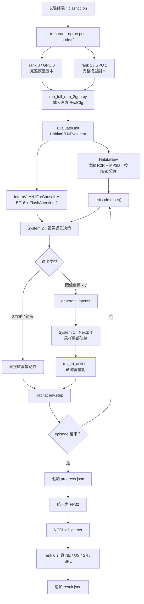

# R2R VLN-CE / InternVLA-N1 DualVLN 双卡复现记录

这份文档记录已经实际跑完的测试：

- benchmark：[主 README](../../README.md) 中的 **VLN-CE Benchmarks / R2R Dataset**
- 模型：**InternVLA-N1 (Dual System) DualVLN**
- 数据切分：`val_unseen`
- 运行方式：Habitat-Lab + Habitat-Sim，GPU 0、1 双进程
- 完整规模：1839 个 episode
- 仓库提交：`7a5c62400ac45b313d9b709c740b64191556a242`

它不是只有一条启动命令，而是从终端、配置、数据分片、模型加载、双系统决策、Habitat 执行动作，一直解释到双卡指标汇总和断点续跑。

## 目录

1. [最终结果](#1-最终结果)
2. [这次到底跑了什么](#2-这次到底跑了什么)
3. [文件、数据和环境](#3-文件数据和环境)
4. [总体调用流程](#4-总体调用流程)
5. [从入口开始逐层读代码](#5-从入口开始逐层读代码)
6. [可复现启动命令](#6-可复现启动命令)
7. [断点续跑的正确方式](#7-断点续跑的正确方式)
8. [结果完整性检查](#8-结果完整性检查)
9. [容易误解的几个点](#9-容易误解的几个点)
10. [本次复现的结论](#10-本次复现的结论)

## 1. 最终结果

### 1.1 与项目 README 的对比

| 指标 | 方向 | README 报告值 | 本次复现 | 差值 |
|---|---:|---:|---:|---:|
| NE | 越低越好 | 4.05 | 4.0745 | +0.0245 |
| OS | 越高越好 | 70.7 | 71.1800 | +0.4800 pp |
| SR | 越高越好 | 64.3 | 65.6335 | +1.3335 pp |
| SPL | 越高越好 | 58.5 | 59.5481 | +1.0481 pp |

本次结果和 README 处在同一水平，三个成功类指标略高，NE 高 0.0245。扩散轨迹采样和一处 Python 随机提示词选择没有固定随机源，所以不应期待逐 episode 或末位小数完全相同。

原始结果位于 [`result.json`](../../logs/habitat/test_dual_system/result.json)：

```json
{
  "sucs_all": 0.6563349366188049,
  "spls_all": 0.5954807996749878,
  "oss_all": 0.7117999196052551,
  "nes_all": 4.074532508850098,
  "length": 1839
}
```

其中 `sucs_all`、`spls_all`、`oss_all` 是 0～1 的比例，和 README 表格比较时需要乘 100；`nes_all` 直接就是米制导航误差。

手工从 1839 行 `progress.json` 重新计算得到：

- 成功 episode：1207，`1207 / 1839 = 65.633496%`
- Oracle Success episode：1309，`1309 / 1839 = 71.179989%`
- SPL 均值：`59.548085%`
- NE 均值：`4.074532`
- episode ID 无重复、无缺失、无额外记录
- SPL 和 NE 均无 NaN/Inf

### 1.2 结果文件

| 文件 | 用途 |
|---|---|
| [`run.log`](../../logs/habitat/test_dual_system/run.log) | 双卡完整运行日志，约 6.4 MB |
| [`progress.json`](../../logs/habitat/test_dual_system/progress.json) | JSON Lines 格式，每行一个 episode 的结果 |
| [`result.json`](../../logs/habitat/test_dual_system/result.json) | rank 0 汇总后的总指标 |
| [`progress.single_gpu_until_switch.json`](../../logs/habitat/test_dual_system/progress.single_gpu_until_switch.json) | 从单卡切换到双卡前 173 条结果的备份 |
| [`run_single_gpu_until_switch.log`](../../logs/habitat/test_dual_system/run_single_gpu_until_switch.log) | 前 173 条单卡阶段日志 |
| [`run_2gpu_short_shell_aborted.log`](../../logs/habitat/test_dual_system/run_2gpu_short_shell_aborted.log) | 第一次短生命周期 shell 启动失败的留档 |

完整结果的校验和：

```text
9990b37ff5b818dcd6adf7f1674f18d9ae55289e4a76b8fe69383f6b00c1155b  progress.json
25a0eb6c6d4647ffb07b91e63581b08b8b2417348ddea012420249f98f48f6e7  result.json
```

## 2. 这次到底跑了什么

核心配置来自 [`habitat_dual_system_cfg.py`](../../scripts/eval/configs/habitat_dual_system_cfg.py)：

| 项目 | 实际值 |
|---|---|
| evaluator | `habitat_vln` |
| environment | `habitat` |
| model | `internvla_n1` |
| mode | `dual_system` |
| checkpoint | `InternVLA-N1-DualVLN` |
| 历史图像数 | 最多 8 帧 |
| VLM 输入尺寸 | 384 × 384 |
| evaluator 最大步数 | 500 |
| 可视化视频 | 关闭 |
| 分布式后端 | `torchrun` + NCCL |

Habitat 任务配置来自 [`vln_r2r.yaml`](../../scripts/eval/configs/vln_r2r.yaml)：

| 项目 | 实际值 |
|---|---|
| dataset type | `R2RVLN-v1` |
| split | `val_unseen` |
| RGB / Depth | 640 × 480，HFOV 79° |
| depth 范围 | 0～10 m |
| 前进一步 | 0.25 m |
| 左右旋转 | 15° |
| 上下转头 | 15° |
| 成功半径 | 3.0 m |
| 动作 | STOP、FORWARD、LEFT、RIGHT、LOOKUP、LOOKDOWN |

模型配置中的 `system1` 是 `nextdit_async`，因此这次确实是 DualVLN 双系统，不是只运行 Qwen2.5-VL 的 `system2` 模式。

这里的“双卡”是**数据并行评测**：

- GPU 0 上的 rank 0 加载一份完整模型；
- GPU 1 上的 rank 1 也加载一份完整模型；
- 两个 rank 分别跑不同 episode；
- 最后用 NCCL 汇总每个 episode 的指标。

它不是把同一份模型按层切到两张卡上的 tensor parallel 或 model parallel。单卡仍需要容纳完整模型和一次推理的中间张量。

## 3. 文件、数据和环境

### 3.1 Python 环境

实际使用的解释器是：

```text
/workspace/flow/work_space/InternNav/data/habitat_env/bin/python
```

关键版本：

| 组件 | 版本 |
|---|---|
| Python | 3.9.23 |
| PyTorch | 2.6.0+cu124 |
| torchvision | 0.21.0+cu124 |
| CUDA runtime | 12.4 |
| FlashAttention | 2.7.3 |
| Transformers | 4.51.0 |
| Diffusers | 0.32.2 |
| Accelerate | 1.4.0 |
| Habitat-Sim | 0.2.4 |
| Habitat-Lab / Baselines | 0.2.4 |

此外已安装 `numpy-quaternion`、`depth_camera_filtering` 和 editable 模式的 InternNav。BF16 FlashAttention CUDA kernel 已在预检中通过，基础测试 5/5 通过，记录见 [`test_basic.log`](../../logs/reproduce_r2r_dualvln/preflight/test_basic.log)。

### 3.2 模型权重

持久化权重：

```text
checkpoints/InternVLA-N1-DualVLN/
```

这一快照包含 4 个 safetensors shard，共约 16.77 GB、1338 个 tensor。模型配置要点是：

```text
architectures = ["InternVLAN1ForCausalLM"]
model_type   = "internvla_n1"
system1      = "nextdit_async"
n_query      = 4
torch_dtype  = "bfloat16"
```

下载时固定的 Hugging Face revision 是：

```text
a698a9e898b4001621a319e1bc89f02ec715cc86
```

Depth Anything 权重位于：

```text
checkpoints/depth_anything_v2_metric_hypersim_vits.pth
```

SHA-256：

```text
b782898d8a3e8be1f639de33837ed85e9b4b73e40f8f5e5cd99067588d722545
```

为避免共享磁盘加载四个大 shard 太慢，正式运行从 RAM 缓存加载：

```text
/dev/shm/flow_internnav_r2r_dualvln/InternVLA-N1-DualVLN
```

`/dev/shm` 在重启后会清空，它只是缓存，持久化原件仍在 `checkpoints/`。

### 3.3 R2R episode 与 MP3D 场景

仓库内使用两个软链接：

```text
data/vln_ce/raw_data/r2r
  -> /mnt/cpfs/zbl-cpfs-new/open_data/InternData-N1/vln_ce/raw_data/r2r

data/scene_data/mp3d_ce
  -> /mnt/cpfs/zbl-cpfs-new/open_data/Scene-N1/mp3d_ce
```

它们分别提供：

1. **R2R VLN-CE episode 数据**：指令、起点、目标、参考路径、scene ID 等；本次读取 `val_unseen/val_unseen.json.gz`，共有 1839 个 episode。
2. **Matterport3D Habitat 场景**：`.glb` 几何、`.navmesh` 可行走网格、`.house` 和语义文件；当前共有 90 套完整场景，`val_unseen` 实际使用其中 11 个未见场景。

本次固定的数据 revisions：

```text
R2R VLN-CE: 7b05993b21813c3787f2f7f604bfc22b80c48c8e
MP3D CE:    2195d46aaab0ff48673b275fdfdc0731075b5ff2
```

R2R `val_unseen.json.gz` 的 SHA-256：

```text
d173d8028537f30ab652dc5d24ead737e2b6010b6a4599f974351685710d18e8
```

### 3.4 EGL

容器原先缺少 NVIDIA GLVND 的 EGL vendor JSON，因此运行时显式指定：

```text
__EGL_VENDOR_LIBRARY_FILENAMES=data/egl_vendor.d/10_nvidia.json
```

该 JSON 把 EGL ICD 指向 `libEGL_nvidia.so.0`。没有它时，Habitat-Sim 的无窗口渲染可能在创建 EGL context 时失败。

## 4. 总体调用流程



## 5. 从入口开始逐层读代码

建议按下面顺序阅读，调用关系最清楚：

1. [双卡运行包装脚本](../../logs/reproduce_r2r_dualvln/run_full_ram_2gpu.py)
2. [官方 Dual System 配置](../../scripts/eval/configs/habitat_dual_system_cfg.py)
3. [R2R Habitat 配置](../../scripts/eval/configs/vln_r2r.yaml)
4. [Evaluator 注册表](../../internnav/evaluator/base.py)
5. [分布式 Evaluator](../../internnav/evaluator/distributed_base.py)
6. [Habitat 环境包装](../../internnav/env/habitat_env.py)
7. [Habitat VLN 主循环](../../internnav/habitat_extensions/vln/habitat_vln_evaluator.py)
8. [InternVLA-N1 双系统模型](../../internnav/model/basemodel/internvla_n1/internvla_n1.py)
9. [System 1 模块构建](../../internnav/model/basemodel/internvla_n1/internvla_n1_arch.py)
10. [轨迹转离散动作](../../internnav/model/utils/vln_utils.py)
11. [R2R 自定义指标](../../internnav/habitat_extensions/vln/measures.py)

### 5.1 `torchrun` 如何生成两个 evaluator

启动命令设置 `CUDA_VISIBLE_DEVICES=0,1`，然后：

```text
torchrun --standalone --nnodes=1 --nproc-per-node=2 ...
```

`torchrun` 启动两个 Python 进程，并设置 `RANK`、`LOCAL_RANK`、`WORLD_SIZE` 等环境变量。[`init_distributed_mode()`](../../internnav/utils/dist.py) 读取这些变量，执行：

1. `torch.cuda.set_device(local_rank)`；
2. 用 NCCL 初始化 process group；
3. rank 0 对应可见 GPU 0，rank 1 对应可见 GPU 1。

[`DistributedEvaluator.__init__()`](../../internnav/evaluator/distributed_base.py) 再把 `rank` 和 `world_size` 注入环境配置，使 Habitat 数据加载器知道如何分片。

### 5.2 为什么使用一个包装脚本

[`run_full_ram_2gpu.py`](../../logs/reproduce_r2r_dualvln/run_full_ram_2gpu.py) 只有 73 行，做了六件事：

1. 检查 RAM 权重目录中是否有 `model.safetensors.index.json`；
2. 动态导入官方 `habitat_dual_system_cfg.py`；
3. 只覆盖 `model_path` 和 `output_path`；
4. 调用 `Evaluator.init(eval_cfg)`；
5. 把每个 rank 返回的指标 tensor 统一成 FP32；
6. 调用 `evaluator.eval()`，最后 barrier 并关闭 process group。

关键逻辑可以压缩为：

```python
eval_cfg = load_official_config()
eval_cfg.agent.model_settings["model_path"] = MODEL_PATH
eval_cfg.eval_settings["output_path"] = OUTPUT_PATH

evaluator = Evaluator.init(eval_cfg)
official_eval_action = evaluator.eval_action

def eval_action_fp32():
    metrics = official_eval_action()
    return {
        name: tensor.to(dtype=torch.float32)
        for name, tensor in metrics.items()
    }

evaluator.eval_action = eval_action_fp32
result = evaluator.eval()
```

这层没有改变 checkpoint、输入、System 1、System 2、动作序列、Habitat episode 或指标定义。

### 5.3 FP32 包装层修复了什么

官方 [`_run_eval_dual_system()`](../../internnav/habitat_extensions/vln/habitat_vln_evaluator.py) 最后对 Python/NumPy 标量列表直接调用：

```python
torch.tensor(sucs)
torch.tensor(spls)
torch.tensor(oss)
torch.tensor(nes)
```

Habitat 返回的标量类型并不总是完全一致。双卡两条 smoke episode 中，不同 rank 曾推断出不同 tensor dtype，随后分布式 `all_gather` 得到损坏的 SPL 值 `2.631772124e-315`，而两条逐 episode 记录本身都是正常的。

统一 FP32 后，同一组 smoke 数据得到：

```json
{
  "sucs_all": 0.5,
  "spls_all": 0.41840988397598267,
  "oss_all": 1.0,
  "nes_all": 3.357146739959717,
  "length": 2
}
```

它与手工均值一致。正式评测也使用这层转换；它只规范通信 dtype，导致的均值舍入误差小于 `1.3e-7`，不是准确率调参。

### 5.4 Evaluator 注册和模型初始化

`eval_cfg.eval_type = "habitat_vln"`。调用 [`Evaluator.init()`](../../internnav/evaluator/base.py) 后，注册表创建 [`HabitatVLNEvaluator`](../../internnav/habitat_extensions/vln/habitat_vln_evaluator.py)。

初始化过程包括：

1. 加载 Hydra Habitat YAML；
2. 创建 `HabitatEnv`；
3. 从 checkpoint 加载 `AutoProcessor`；
4. 因为 `mode == "dual_system"`，加载 `InternVLAN1ForCausalLM`，而不是仅加载 `Qwen2_5_VLForConditionalGeneration`；
5. 使用 BF16、`flash_attention_2` 和当前 rank 的整张 GPU；
6. 设置导航 prompt、历史帧上限和动作字符映射。

动作字符映射为：

```text
STOP -> 0
↑    -> 1  MOVE_FORWARD
←    -> 2  TURN_LEFT
→    -> 3  TURN_RIGHT
↓    -> 5  LOOK_DOWN
```

### 5.5 数据怎样被两个 rank 切分

[`HabitatEnv.generate_episodes()`](../../internnav/env/habitat_env.py) 先按 scene 分组，再按 scene 名排序。对每个 scene 执行：

```python
per_scene_eps[rank::world_size]
```

因此两个 rank 在每个 scene 内交错取 episode，而不是先把整个 JSON 简单切成上下两半。

它还会先读取已有 `progress.json`，把 `(scene_id, episode_id)` 放进 `done_res`。已完成 episode 会直接跳过，这构成断点续跑。

本次运行历史是：

- GPU 0 单卡阶段已完成 173 条；
- 切换为双卡时保留原 `progress.json`；
- rank 0 加载这 173 条历史指标，再处理 835 条；
- rank 1 处理 831 条；
- 最终 `173 + 835 + 831 = 1839`。

两个 rank 都依据同一 `done_res` 跳过旧结果，最终又用全量数据 key 做了无重复、无缺失验证。

### 5.6 每个 episode 的主循环

主循环位于 [`_run_eval_dual_system()`](../../internnav/habitat_extensions/vln/habitat_vln_evaluator.py)，可以按以下阶段理解。

#### A. reset 和元数据

`env.reset()` 把 Habitat 的 `current_episode` 指到分片后的下一项，返回 RGB、depth、GPS、compass 等 observation。evaluator 读取：

- `scene_id`；
- `episode_id`；
- 自然语言导航指令；
- 初始 RGB 帧。

#### B. 观测预处理

每次决策取当前 RGB 和 depth。depth 从归一化值恢复到配置的 0～10 m，并经过过滤。代码还让相机连续执行两次 LOOKDOWN，取得朝下 RGB/depth，再执行两次 LOOKUP 恢复视角。

当前正视 RGB 会缩放为 384 × 384 供 VLM 使用；朝下图像缩放到 224 × 224 供局部轨迹模块使用。

#### C. 构造 System 2 上下文

首步只有当前帧。后续从历史中用 `np.linspace` 均匀抽取最多 8 帧，再附上当前帧。自然语言指令、历史图像、当前图像被组装成 Qwen chat template。

System 2 的核心问题是：根据指令和视觉历史，输出下一图像 waypoint 的坐标；如果到达目标则输出 STOP。

生成参数是确定性语言解码：

```text
max_new_tokens = 128
do_sample      = False
use_cache      = True
```

#### D. System 2 的两类输出

如果文本中有数字，代码把它解释成图像 waypoint 坐标。随后：

1. `generate_latents()` 在输出 token 后插入 4 个 trajectory query；
2. 再跑一次多模态 transformer；
3. 取最后 4 个 query 的 hidden states 作为轨迹条件；
4. 调用 System 1 的 `generate_traj()`。

如果输出是 STOP 或箭头，`parse_actions()` 直接转成离散 Habitat 动作。也就是说，模型配置始终是双系统，但某一次决策若 System 2 已直接给出符号动作，该次不需要调用 System 1。

#### E. System 1 / NextDiT 局部轨迹

[`generate_traj()`](../../internnav/model/basemodel/internvla_n1/internvla_n1.py) 的 `nextdit_async` 分支：

1. 用 RGB 视觉编码器提取朝下图像特征；
2. 通过 `MemoryEncoder` 和 Q-Former/resampler 得到 memory tokens；
3. 与 System 2 的 trajectory latents 拼接；
4. 从高斯噪声采样 32 条候选轨迹；
5. 每条预测 32 个 `(dx, dy, d_yaw)`；
6. 使用 FlowMatch Euler scheduler 做 10 步去噪。

R2R 表格把 DualVLN observation 标成 RGB。Habitat 的公共 evaluator 仍创建 RGB-D agent 并预处理 depth，但在这个 checkpoint 的 `nextdit_async` 代码分支中，`generate_traj()` 的条件特征来自 RGB；传入的 `depths_dp` 没有参与该分支计算。这解释了“YAML 有 depth sensor”和“论文表格写 RGB”为什么不矛盾。

#### F. 连续轨迹转离散动作

[`traj_to_actions()`](../../internnav/model/utils/vln_utils.py)：

1. 对 32 条采样轨迹取平均；
2. 累积 `dx/dy`，重建局部二维路径；
3. 每次向前看 4 个轨迹点；
4. 把朝向差量化成 15° 左/右转；
5. 把位移量化成 0.25 m 前进；
6. 接近局部目标时停止。

evaluator 一次最多缓存并执行 4 个 local actions，之后重新观察和规划，形成 receding-horizon 闭环。

#### G. 执行动作和结束

动作传给 `HabitatEnv.step()`，再由 Habitat-Sim 更新相机位姿、碰撞和任务状态。episode 在以下情况之一结束：

- 模型执行 STOP；
- Habitat 判断 episode over；
- evaluator 达到步数上限。

配置写的是 500，但循环条件是 `step_id <= max_steps_per_episode`，所以记录中最大 `steps` 可以是 501；本次有 76 条记录达到或超过 500。这是当前源码的边界行为，不是额外修改。

### 5.7 指标如何写入与汇总

每个 episode 结束后，[`HabitatVLNEvaluator`](../../internnav/habitat_extensions/vln/habitat_vln_evaluator.py) 追加一行：

```json
{
  "scene_id": "zsNo4HB9uLZ",
  "episode_id": 1808,
  "success": 0.0,
  "spl": 0.0,
  "os": 0.0,
  "ne": 3.625661849975586,
  "steps": 79,
  "episode_instruction": "..."
}
```

四个指标含义：

- **NE / Navigation Error**：结束时到目标的 geodesic distance，越低越好。
- **OS / Oracle Success**：整个轨迹中曾经进入目标 3 m 范围即为 1，不要求在那一刻 STOP。
- **SR / Success Rate**：在目标 3 m 范围内正确结束导航的比例。
- **SPL**：成功率按实际路径相对最短路径的效率加权，常写作 `S_i * l_i / max(l_i, p_i)`。

[`DistributedEvaluator.eval()`](../../internnav/evaluator/distributed_base.py) 汇总流程是：

1. 每个 rank 得到本地一维指标 tensor；
2. `all_gather` 每个 rank 的真实长度；
3. 把每项指标 padding 到共同最大长度；
4. NCCL `all_gather`；
5. 去 padding 并拼接；
6. rank 0 计算均值；
7. 把结果追加到 `result.json`。

`calc_metrics()` 还会把 NaN SPL 置零，并只对有限 NE 求均值。

## 6. 可复现启动命令

### 6.1 先在长驻终端开启代理

进入仓库后保持同一个交互终端：

```bash
cd /workspace/flow/work_space/InternNav
source ~/.bashrc
clashctl on

pgrep -af mihomo
env | rg -i 'http_proxy|https_proxy|all_proxy'
```

本地权重和数据齐全后，benchmark 主循环本身不访问网络；代理主要保证安装和 Hugging Face 下载阶段稳定。按本机约定，运行结束也不执行 `clashctl off`。

### 6.2 快速预检

```bash
data/habitat_env/bin/python - <<'PY'
import torch
import flash_attn
import habitat
import habitat_sim
import internnav

print("torch:", torch.__version__)
print("CUDA runtime:", torch.version.cuda)
print("CUDA available:", torch.cuda.is_available())
print("GPU count:", torch.cuda.device_count())
print("FlashAttention:", flash_attn.__version__)
PY

test -f checkpoints/InternVLA-N1-DualVLN/model.safetensors.index.json
test -f data/vln_ce/raw_data/r2r/val_unseen/val_unseen.json.gz
test -d data/scene_data/mp3d_ce/mp3d

sha256sum checkpoints/depth_anything_v2_metric_hypersim_vits.pth
```

预期 Depth Anything 哈希必须是本文件第 3.2 节记录的值。

### 6.3 准备 RAM 权重缓存

机器重启后如果 `/dev/shm` 缓存消失，重新复制：

```bash
ram_root=/dev/shm/flow_internnav_r2r_dualvln
mkdir -p "$ram_root"
cp -a checkpoints/InternVLA-N1-DualVLN "$ram_root/"

test -f "$ram_root/InternVLA-N1-DualVLN/model.safetensors.index.json"
```

直接从共享磁盘加载也能运行，但两个 rank 同时读取约 16.8 GB 权重会显著拖慢启动。

### 6.4 用 GPU 0、1 启动一个全新的评测

建议每次独立复现使用新的空输出目录，避免和已有结果混在一起：

```bash
run_tag=r2r_dualvln_$(date +%Y%m%d_%H%M%S)
output_dir=logs/habitat/$run_tag
mkdir -p "$output_dir"

nohup env \
  CUDA_VISIBLE_DEVICES=0,1 \
  __EGL_VENDOR_LIBRARY_FILENAMES=/workspace/flow/work_space/InternNav/data/egl_vendor.d/10_nvidia.json \
  TOKENIZERS_PARALLELISM=false \
  MAGNUM_LOG=quiet \
  HABITAT_SIM_LOG=quiet \
  INTERNVLA_MODEL_PATH=/dev/shm/flow_internnav_r2r_dualvln/InternVLA-N1-DualVLN \
  DUALVLN_OUTPUT_PATH="$output_dir" \
  data/habitat_env/bin/torchrun \
    --standalone \
    --nnodes=1 \
    --nproc-per-node=2 \
    logs/reproduce_r2r_dualvln/run_full_ram_2gpu.py \
  > "$output_dir/run.log" 2>&1 < /dev/null &

dual_pid=$!
printf '%s\n' "$dual_pid" > "$output_dir/pid"
disown "$dual_pid"
```

这次已经完成的正式测试使用相同命令，只是：

```text
DUALVLN_OUTPUT_PATH=logs/habitat/test_dual_system
```

### 6.5 监控

```bash
output_dir=logs/habitat/test_dual_system

tail -f "$output_dir/run.log"
wc -l "$output_dir/progress.json"
nvidia-smi
ps -fp "$(cat "$output_dir/pid")"
```

本次双卡续跑阶段 rank 0 的 835 条耗时 `10:30:54`。此前已有 173 条单卡结果，所以从零开始的总墙钟时间应按约 12 小时预留，实际取决于 episode 步数和 GPU 占用。

## 7. 断点续跑的正确方式

如果进程意外中止：

1. 不要删除或截断 `progress.json`；
2. 确认没有旧 `torchrun` / worker 仍在运行；
3. 用同一个 `DUALVLN_OUTPUT_PATH` 重启相同命令；
4. 环境会跳过已经出现的 `(scene_id, episode_id)`；
5. rank 0 会把历史逐 episode 指标纳入最终汇总。

注意：

- 不要同时启动两个 torchrun 写同一个输出目录；
- 想做独立新实验时必须换一个空目录；
- `result.json` 使用追加模式，同一目录多次完成可能出现多行；
- `progress.json` 是最终事实来源，汇总后仍应检查 episode 唯一性和覆盖率。

第一次双卡尝试是由生命周期很短的执行 shell 启动的，父 `torchrun` 被回收，虽然子 worker 一度残留，但任务不再可靠。因此正式运行使用长驻交互终端中的 `nohup + disown`。在集群环境中也可以换成 tmux、systemd 或调度器作业，但不要依赖会立即销毁的临时 shell。

## 8. 结果完整性检查

下面的脚本从数据集和逐 episode 文件独立复算：

```bash
data/habitat_env/bin/python - <<'PY'
import gzip
import json
import math
from pathlib import Path

dataset_path = Path(
    "data/vln_ce/raw_data/r2r/val_unseen/val_unseen.json.gz"
)
progress_path = Path(
    "logs/habitat/test_dual_system/progress.json"
)

with gzip.open(dataset_path, "rt") as f:
    dataset = json.load(f)

rows = [
    json.loads(line)
    for line in progress_path.read_text().splitlines()
    if line.strip()
]

expected = {
    (episode["scene_id"].split("/")[-2], int(episode["episode_id"]))
    for episode in dataset["episodes"]
}
actual = {
    (row["scene_id"], int(row["episode_id"]))
    for row in rows
}

assert len(rows) == 1839
assert len(actual) == len(rows)
assert expected == actual
assert all(math.isfinite(float(row["spl"])) for row in rows)
assert all(math.isfinite(float(row["ne"])) for row in rows)

n = len(rows)
sr = sum(float(row["success"]) for row in rows) / n
spl = sum(float(row["spl"]) for row in rows) / n
os_ = sum(float(row["os"]) for row in rows) / n
ne = sum(float(row["ne"]) for row in rows) / n

print({
    "episodes": n,
    "SR_percent": sr * 100,
    "SPL_percent": spl * 100,
    "OS_percent": os_ * 100,
    "NE": ne,
})
PY
```

还可以检查运行日志中是否存在关键错误：

```bash
rg -n \
  'Traceback|OutOfMemory|CUDA error|NCCL.*error|segmentation fault|ChildFailed' \
  logs/habitat/test_dual_system/run.log
```

本次该检查没有发现 Traceback、OOM、CUDA、NCCL、段错误或 `ChildFailed`。

## 9. 容易误解的几个点

### “Dual System”是不是“双 GPU”？

不是同一个概念。

- **Dual System**：模型算法结构，System 2 做语义/视觉高层决策，System 1 做快速局部轨迹生成。
- **双 GPU**：评测吞吐方式，两个完整模型副本分别处理 episode。

本次两者同时存在。

### README 写 RGB，为什么 Habitat 配置是 RGB-D？

因为共享 evaluator 使用 RGB-D Habitat agent，并执行公共 depth 预处理；但 DualVLN checkpoint 的 `nextdit_async` 轨迹分支只用 RGB 特征。depth 参数传入函数，却没有在这一分支参与条件计算。

### 为什么结果不是 README 的精确数字？

System 2 文本生成设置为 `do_sample=False`，但整个系统仍不是严格确定性的：

- evaluator 用 `random.choice` 选择提示连接词，未固定 Python `random`；
- NextDiT 用 `randn_tensor(generator=None)` 生成轨迹初始噪声；
- CUDA kernel、软件版本和数据 revision 也可能产生小差异。

因此应比较完整 split 的聚合指标，而不是追求 bit-for-bit 一致。

### 为什么保留逐 episode 文件？

`result.json` 只有均值，无法证明是否漏跑、重复或包含 NaN。`progress.json` 可以：

- 断点续跑；
- 验证 1839 条覆盖；
- 手工复算；
- 定位异常 scene/episode；
- 分析步数和成功失败案例。

## 10. 本次复现的结论

在当前提交、上述固定权重和 R2R/MP3D 数据上，InternVLA-N1 DualVLN 已经通过 Habitat 完成全部 1839 个 `val_unseen` episode。运行模式是官方 `dual_system`，System 1 为 `nextdit_async`，GPU 0 和 1 做 episode 级数据并行。最终四项指标与项目 README 的 R2R DualVLN 报告值一致到合理实验波动范围，且逐 episode 覆盖、数值有限性和手工聚合均已验证。
